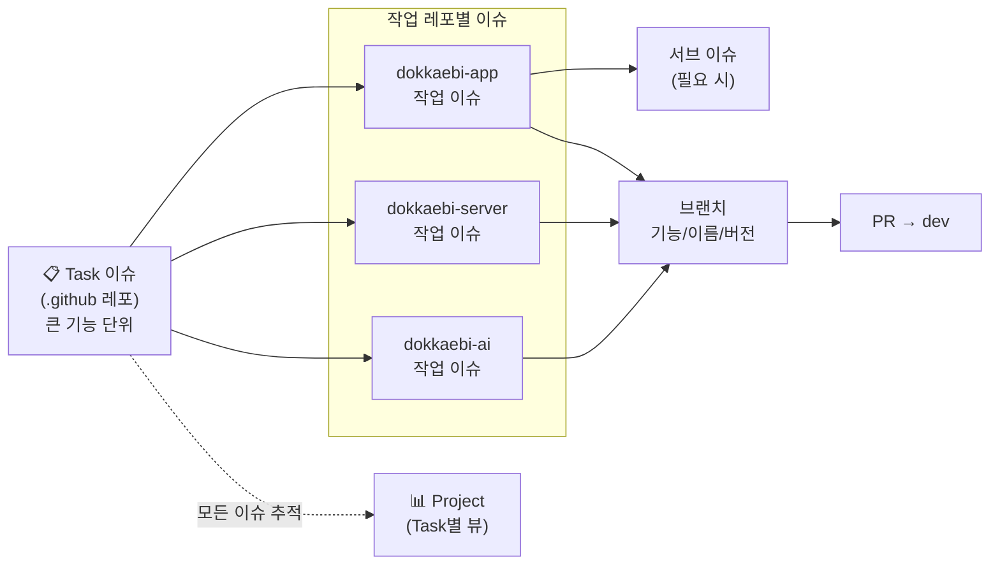

# 협업 가이드 — 도깨비: 팔도의 비밀

> 이슈/프로젝트 운영 · 브랜치 전략 · 커밋 컨벤션 · PR 규칙. **작업 시작 전에 꼭 읽기.**
> 조직: [`2026-genai-ar-tourism-data-rpg`](https://github.com/2026-genai-ar-tourism-data-rpg)

---

## 0. 전체 흐름 한눈에



**기본 사이클**
1. **Task 생성** — 개발할 기능을 `.github` 레포에 **Task 이슈**로 만든다 (여러 레포에 걸친 큰 단위).
2. **작업 이슈 생성** — 각자 자기가 맡을 레포에 들어가 그 Task를 보고 **작업 이슈**를 만든다 (상위 Task 링크). 필요하면 **서브 이슈**로 더 쪼갠다.
3. **브랜치** — 작업 이슈에서 브랜치를 따서 개발 (`<기능>/<이름>/<버전>`).
4. **PR** — `dev`로 PR, 리뷰 1인 승인 후 머지.
5. **Project** — 모든 이슈를 Project에 올려 **Task별/영역별**로 진행상황을 본다.

---

## 1. 이슈 & 프로젝트 운영

### 1-1. Task 이슈 (`.github` 레포)
- **여러 레포에 걸친 큰 기능 단위**. 예: "솔로 수직 슬라이스", "4인 협력 멀티".
- `.github` 레포에서 **📋 Task 템플릿**으로 생성.
- 본문에 **하위 작업 체크리스트**로 각 레포 작업 이슈를 링크 (`레포#번호`).

### 1-2. 작업 이슈 (각 작업 레포)
- 내가 실제로 코딩할 단위. 예: app의 "AR 단서 오버레이", server의 "퀘스트 API".
- 해당 레포에서 **✨ 작업 템플릿**으로 생성, **상위 Task를 반드시 링크**.
- 더 잘게 나눌 게 있으면 GitHub **서브 이슈(sub-issue)** 로 분해.

### 1-3. Project 세팅 (조직 Project 1개)
> 목적: "이 Task에서 **프론트는 어디까지, 백엔드는 어디까지** 됐나"를 한 화면에서 보기.

- **커스텀 필드**
  - `Status`: Todo / In Progress / In Review / Done
  - `Area`: App / Server / AI / Infra / Data / Design
  - `Task`: 상위 Task 연결 (서브이슈 관계 또는 단일 선택 필드)
  - `Milestone`: M0~M4
- **뷰(View) 구성**
  - 🗂 **Task별 보드** — `Task`로 그룹핑 → Task 하나에 달린 모든 레포 이슈가 한 묶음으로 보임 ⭐핵심
  - 🧩 **Area별 보드** — `Area`로 그룹핑 → 프론트/백/AI 각 영역 진행률
  - 🙋 **내 작업** — assignee = 나 필터
  - 📅 **마일스톤별** — `Milestone`로 그룹핑
- **자동화**: 새 이슈 자동 추가, PR 머지 시 Done 처리 (Project 워크플로우)

---

## 2. 브랜치 전략

```
main ─────────●────────────────●──────  (배포/제출 시점, 보호 브랜치)
               \              /
dev ───●────●───●────●───●───●─────────  (기본 통합 브랜치)
        \        \         /
         feature  feature 작업 브랜치들
```

- **`main`** — 배포/제출용. **보호**(직접 푸시 금지, PR로만). `dev`에서만 머지.
- **`dev`** — 평소 통합 브랜치. 모든 작업 브랜치가 여기로 모인다.
- **작업 브랜치** — `<기능>/<이름>/<버전>`

### 2-1. 브랜치 이름 규칙
```
<기능>/<이름>/<버전>
```
- **기능(scope)** — 폴더명 / 파이프라인명 (예: `rag`, `data`, `refine`)
- **이름** — 개발자 (영문): `yeseul` `jiseon` `junhyung` `chanhee`
- **버전** — 그 작업의 반복 회차: `v1`, `v2` …

**예시**
```
rag/junhyung/v1
ar/chanhee/v1
node-builder/jiseon/v1
realtime/yeseul/v2
```

### 2-2. 이 프로젝트에서 나올 `기능(scope)` 예시
| 영역 | scope 예시 |
|---|---|
| AI (`dokkaebi-ai`) | `eda` · `rag` · `embedding` · `scenario`(조립) · `npc` · `prompt` · `refine` |
| App (`dokkaebi-app`) | `ar` · `gps` · `map` · `quest-ui` · `party` · `chat` · `wishlist` |
| Server (`dokkaebi-server`) | `tour-collect`(수집) · `node-builder` · `quest-api` · `auth` · `realtime` · `ranking` |
| Infra (`dokkaebi-infra`) | `compose` · `ci` · `deploy` · `monitoring` |
| 공통 | `data` · `design` · `docs` |

---

## 3. 커밋 컨벤션 (Conventional Commits)

```
<type>(<scope>): <한 줄 요약>
```
- **type**: `feat`(기능) · `fix`(버그) · `docs` · `style` · `refactor` · `test` · `chore`
- **scope**: 위 기능 scope와 동일 (생략 가능)
- 요약은 한글 OK, 명령형/현재형 권장

**예시**
```
feat(rag): NPC 대사 생성 함수 추가
fix(gps): 반경 진입 중복 트리거 수정
docs(server): 퀘스트 API 명세 업데이트
chore(infra): docker-compose redis 추가
```
- 이슈 자동 연결: 커밋/PR 본문에 `Closes #12` → 머지 시 이슈 자동 종료

---

## 4. PR 규칙

- 작업 브랜치 → **`dev`로 PR** (main 직접 PR ❌)
- **리뷰어 1명 승인** 후 머지
- 머지 방식: **Squash merge** 권장 (히스토리 깔끔)
- PR 본문: 관련 이슈(`Closes #`) + 변경 요약 + (앱은) 스크린샷
- `dev` → `main`은 배포/제출 시점에 별도 PR(릴리스)

---

## 5. 템플릿 위치 (이 레포 안)

| 용도 | 경로 | 적용 범위 |
|---|---|---|
| Task 이슈 템플릿 | `.github/ISSUE_TEMPLATE/task.yml` | `.github` 레포 |
| PR 템플릿 | `.github/PULL_REQUEST_TEMPLATE.md` | 조직 전체 기본값 |
| 작업/버그 템플릿 키트 | `templates/work-repo/` | **각 작업 레포에 복사** |

> 작업 레포(app/server/ai/infra)는 [templates/work-repo/](./templates/work-repo/)의 `.github/` 폴더를 **레포 루트에 복사**하면 동일한 이슈/PR 템플릿이 적용됩니다. (자세한 건 그 폴더의 README 참고)
