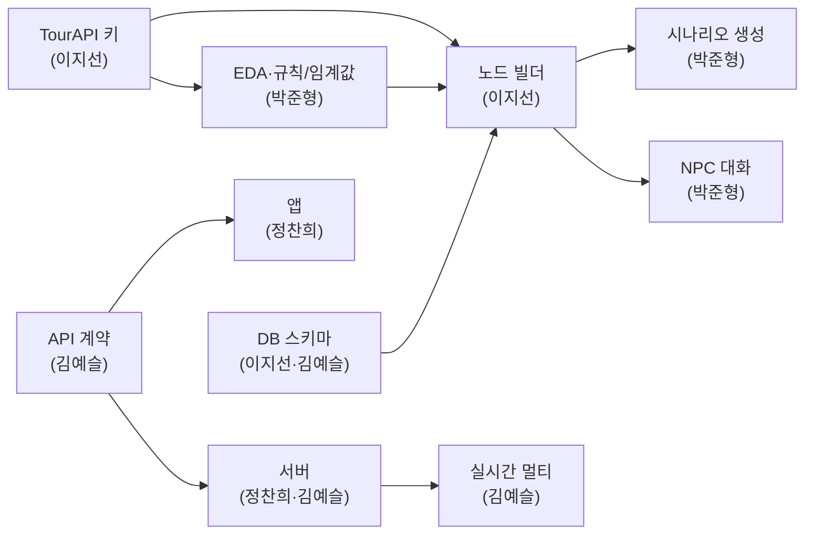

# 도깨비: 팔도의 비밀 — 개발 계획

> 개발 인원 4명. 파일럿 무대 = 서울 종로. 아키텍처는 [아키텍처_파이프라인.md](./아키텍처_파이프라인.md), 기능은 [기획_사용자시나리오.md](./기획_사용자시나리오.md) 기준.

---

## 1. 역할 분담 (강점 기반)

| 이름 | 강점 | 주 담당 레이어 | 주 레포 |
|---|---|---|---|
| **이지선** | 데이터 · **디자인** | 데이터 파이프라인 ① + **AI: RAG 지식베이스(임베딩) + NPC 페르소나 데이터 저작** + 게임 백엔드 데이터 함수 + UI/UX·에셋 | `dokkaebi-server`(데이터) + `dokkaebi-ai`(임베딩·페르소나) + DB + 디자인 |
| **박준형** | 딥러닝·데이터처리·스크립트 | **데이터 분석/EDA** + **찐 AI = 품질·알고리즘**(프롬프트 설계·생성 품질·**검색 알고리즘**·eval — *서비스 X*) | `dokkaebi-ai`(AI 품질) + 데이터 분석 |
| **정찬희** | 풀스택 | **앱(Flutter·AR·GPS)** + **게임 백엔드 함수 구현** + **AI 엔지니어링**(FastAPI 서빙·**RAG 배선**·LLM 클라이언트·캐시) | `dokkaebi-app` + `dokkaebi-server`(구현) + `dokkaebi-ai`(서빙·배선) |
| **김예슬** | 올라운더 | 리드/통합 + 인프라 + **게임 백엔드 baseline + AI 오케스트레이션(LangGraph 그래프: 노드·엣지·상태)** + **FastAPI**(찬희와) + 실시간 동시성 | `dokkaebi-server` + `dokkaebi-ai` + `dokkaebi-infra` + 통합 |

> **부하 분산**: 정찬희 님이 앱+서버를 다 지면 과부하라, **백엔드 API·실시간은 김예슬**이 가져가고 정찬희는 **앱 구현에 집중**한다. **화면·에셋 디자인은 이지선**이 맡아(데이터 작업은 초반 집중형 → 중후반 여유) 정찬희는 *디자인하지 않고 구현만* 하면 된다. → 디자인 파이프라인: **이지선 설계 → 정찬희 구현**.
>
> **후반 재조정(M3)**: 김예슬이 서버+인프라+실시간+AI서빙+리드까지 지므로 전반 부하가 크다. **앱이 안정되는 M3부터 정찬희가 서버 API 일부를 도로 받아**(공용 시나리오·도감 API 등) 김예슬을 통합·QA 리드로 전환시킨다.

> **데이터 분담**: 데이터 작업을 둘로 나눈다. **이지선 = 파이프라인 엔지니어링**(수집·변환·적재 plumbing), **박준형 = 분석/EDA**(TourAPI 데이터 분포·품질을 파보고 *규칙과 임계값*을 도출). EDA 산출물이 양쪽에 먹인다 — ① **비인기지 라벨 컷오프**(혼잡도/방문도 분포), ② 카테고리 코드 → 퀘스트 유형 매핑, ③ 설명·역사 텍스트 길이/품질 → **RAG 청킹 전략**, ④ 지역별 관광지 밀도 → 앵커+샛길 동선 파라미터, ⑤ 행사·축제 데이터 구조 → 시즌 퀘스트. (앞서 기획서 7-3의 "비인기지 최소 비율" 같은 **숫자를 EDA로 실측해 확정**.)
>
> **AI 백엔드(`dokkaebi-ai`) 모듈 분담** — 4명이 *겹치지 않게* 나눈다. 경계 원칙: **박준형=품질·알고리즘 / 정찬희=서빙·배선·운영 / 이지선=재료(지식베이스·페르소나) / 김예슬=오케스트레이션**.
>
> | 모듈 | 하는 일 | 담당 | 포폴 키워드 |
> |---|---|---|---|
> | 오케스트레이션 (**baseline**) | **LangGraph 그래프 설계**(노드·엣지·상태) — 함수 호출 순서·**페르소나 주입 시점**·RAG→조립→LLM 흐름·멀티턴 상태. *직접 구현 ❌, 노드는 박준형/정찬희/이지선 함수 호출* | **김예슬** | LangGraph 오케스트레이션 |
> | 서빙 (FastAPI) | 엔드포인트·스키마·에러·요청 큐 | **김예슬+정찬희** | LLM 서빙 |
> | LLM 클라이언트·캐시 | 호출/재시도/타임아웃/토큰, 응답 캐시 | **정찬희** | LLM 파이프라인 |
> | RAG 배선 | VectorDB 연결·검색 호출·프롬프트 주입 코드 | **정찬희** | RAG 엔지니어링 |
> | **RAG 지식베이스(임베딩)** | 청킹 구현·임베딩 생성·인덱싱·검색 데이터 품질 | **이지선** | RAG·임베딩·VectorDB |
> | **NPC 페르소나 데이터** | 캐릭터 디자인 → 페르소나 시드/프롬프트 저작 | **이지선** | 프롬프트·페르소나 |
> | 검색 품질 알고리즘 | 청킹 전략·임베딩 선택·top-k·재랭킹·쿼리 변환 | **박준형** | RAG 최적화 |
> | 프롬프트·생성 | 대사/시나리오 프롬프트 설계, 출력 튜닝 | **박준형** | 프롬프트 엔지니어링 |
> | eval | 생성 품질·환각 평가셋, 회귀 체크 | **박준형** | LLM 평가 |
>
> **박준형 ↔ 정찬희 경계** = "*무엇을 어떻게 잘 생성·검색하나*(박준형) vs *그걸 실제로 호출·연결·운영*(정찬희)". **박준형 ↔ 이지선 경계**(RAG) = "*어떻게 잘 찾나=검색 전략*(박준형) vs *찾을 대상 데이터 구축=지식베이스*(이지선)". 박준형은 AI 알맹이 함수만, 서비스/서빙은 안 건드림.
>
> **오케스트레이션 = LangGraph 채택**: 흐름을 직접 짜지 않고 LangGraph `StateGraph`로 구성. **단, LangChain 풀세트는 안 씀** — LangGraph(그래프)만 쓰고 각 노드는 우리 함수(RAG·LLM·페르소나)를 호출. 김예슬은 그래프(노드·엣지·상태) 설계, 노드 본문은 박준형/정찬희/이지선. 멀티턴 상태·분기(캐시 히트·재검색)를 그래프로 표현.
>
> **게임 백엔드(`dokkaebi-server`)**: baseline(김예슬, 구조·계약·빈 함수 시그니처) → 함수 본문을 둘로 — **데이터/API 호출 = 이지선**, **그 외 게임 로직 = 정찬희**.

### 레포별 오너 (CODEOWNERS)

| 레포 | 오너 | 서브 |
|---|---|---|
| `dokkaebi-app` | 정찬희 | 이지선(디자인·에셋), 김예슬 |
| `dokkaebi-server` | 김예슬(baseline) | 이지선(데이터/API 함수), 정찬희(게임 로직 함수) |
| 디자인(공통) | 이지선 | — |
| `dokkaebi-ai` | 김예슬(오케스트레이션·서빙) + 박준형(품질·알고리즘) | 정찬희(서빙·RAG 배선·클라이언트), 이지선(임베딩·페르소나) |
| `dokkaebi-infra` | 김예슬 | — |

> **결합 규칙**: 앱 ↔ 서버 ↔ AI는 **API 계약(OpenAPI/WebSocket 스펙)으로만 결합**. 계약은 김예슬이 관리, 변경 시 PR로 공유. → 각자 mock으로 병렬 개발 가능(서로 안 막힘).

---

## 2. 개발 철학 — "수직 슬라이스 먼저"

가장 위험한 건 **AR + GPS + 실시간**이다. 그래서 기능을 가로로(전부 조금씩) 쌓지 않고, **세로로(한 퀘스트를 끝까지)** 먼저 관통시켜 리스크를 일찍 깬다.

> 🎯 **1차 목표 = 종로 단 1개 장소에서 "GPS 진입 → NPC 대화 → AR 단서 → 사건 해결"이 끝까지 도는 것.** 이게 되면 나머진 콘텐츠·확장.

---

## 3. 마일스톤 (상대 주차 — 실제 마감일에 맞춰 역산 조정)

```mermaid
gantt
    title 개발 로드맵 (10주 기준, 마감일에 맞춰 압축/확장)
    dateFormat  X
    axisFormat  %s

    section 기반
    M0 셋업·계약            :m0, 0, 1
    section 수직 슬라이스
    M1 솔로 1퀘스트 관통     :m1, 1, 3
    section 확장
    M2 AI 본격 + 멀티유저    :m2, 4, 3
    section 완성
    M3 맞춤·공용화·밸런싱    :m3, 7, 2
    M4 QA·발표자료·제출      :m4, 9, 1
```

### M0 — 셋업 & 계약 (≈1주)
| 담당 | 할 일 |
|---|---|
| 김예슬 | repo 5개 셋업, CI, `docker-compose`(server+ai+pg+redis), API 계약 v0(OpenAPI), **게임 백엔드 baseline**(구조·라우팅·빈 함수 시그니처) + **AI 오케스트레이션 골격(LangGraph StateGraph: 노드·엣지·상태 스키마)** + **FastAPI 골격**(정찬희와) → 팀원이 노드 함수 본문 채우게 |
| 이지선 | **TourAPI 키 발급**, 응답 스키마 분석, DB 스키마 v0(노드/퀘스트/유저) 설계, **디자인: 무드보드·컬러/타이포·핵심 화면 와이어프레임 초안** |
| 박준형 | **TourAPI EDA**(필드 커버리지·카테고리 분포·혼잡도 결측·텍스트 길이/품질 → 노드 빌더·밸런싱에 줄 규칙/임계값 1차 도출), LLM·임베딩 키 확보, **RAG 프로토타입을 순수 Python 스크립트로**(노드 1개로 검색→대사 생성 확인) |
| 정찬희 | Flutter 골격, 지도 + 현재위치 표시, 서버 mock 연동 |
| **DoD** | `docker compose up`으로 전원 로컬 풀스택 기동, 앱에 내 위치+더미 마커 표시 |

### M1 — 솔로 수직 슬라이스 (≈2주) ⭐핵심
| 담당 | 할 일 |
|---|---|
| 이지선 | **노드 빌더 1차**: 종로 관광지 수집 → 노드 변환(좌표·카테고리·설명·인기라벨) → DB 적재 / **디자인: 솔로 핵심 화면(지도·NPC대화·AR·해결) + 도깨비 NPC·단서 오브젝트 1종 에셋** |
| 정찬희 | GPS 반경 진입 → 퀘스트 활성화, NPC 대화 UI, **AR 카메라 단서 오브젝트** 1종, 사건 해결 화면 |
| 박준형 | **완전 찐 AI**: RAG 검색 품질·프롬프트·대사 생성(서빙은 안 건드림, 함수만). 처음엔 고정 대사 → AI 대사 순 |
| 정찬희 | (앱 외) **게임 백엔드 함수 구현** 합류 + **AI 백엔드: FastAPI 서빙 + RAG 로직 배선**(박준형 AI 함수 연결) — *AI 맛보기* |
| 이지선 | (데이터 외) **게임 백엔드 데이터/API 호출 함수 구현**(노드 조회·퀘스트 데이터 액세스) |
| 김예슬 | baseline 위에서 **LangGraph 오케스트레이션(노드 연결·페르소나 주입) + 퀘스트 API 연결**, 실시간 기반, 통합, 동선 현장 테스트 |
| **DoD** | **종로 1개 장소에서 한 사건이 끝까지 클리어**(앱↔서버↔AI 실제 연동) |

### M2 — AI 본격 + 멀티유저 (≈3주)
| 담당 | 할 일 |
|---|---|
| 박준형 | **시나리오 생성 엔진(배치 스크립트)**(노드 선택기 규칙 7-3 + LLM 조립), 개인화 힌트, 임베딩 파이프라인 정식화 |
| 이지선 | 노드 빌더 확장(종로 전역 + 비인기지), **AI: RAG 지식베이스 구축(청킹·임베딩·VectorDB 인덱싱) + NPC 페르소나 시드 저작**, 행사·축제 → 시즌 퀘스트 소스, **디자인: 파티/멀티·랭킹·채팅 UI** |
| 김예슬 | **실시간 멀티유저**: Socket.io 룸, 4인 파티, **단서 동기화·랭킹(Redis 동시성: Lua/Sorted Set)** |
| 정찬희 | 파티 UI(초대·파티창·실시간 단서 공유), 인게임 채팅, AR 오브젝트 다양화 *(이지선 설계 기반 구현)* |
| **DoD** | 4인 협력 1사건 클리어 + 경쟁 모드 랭킹 동작, AI 생성 시나리오 1개 플레이 |

### M3 — 맞춤·공용화 + 밸런싱 (≈2주)
| 담당 | 할 일 |
|---|---|
| 정찬희 | 위시리스트 입력 UX(검색/지도핀/태그), 시나리오 라이브러리 화면 *(이지선 설계 기반 구현)* / **🔄 앱 안정화 후 서버 API 일부 분담**(공용 시나리오·도감/칭호 API 등) |
| 박준형 | 위시리스트 기반 맞춤 생성(앵커+샛길), 공용화 자동검수(규칙·텍스트 필터) |
| 이지선 | **혼잡도 → 비인기지 보상 가중치** 밸런싱 데이터, 시즌 퀘스트 자동 생성·만료, **디자인: 위시리스트·라이브러리·도감/칭호 UI 설계** |
| 김예슬 | 공용 시나리오 풀(등록 게이트·평점/완주율), 도감·칭호·보상 시스템 통합 *(일부 API는 정찬희에 위임)*, 전체 통합·QA 리드 전환 |
| **DoD** | 위시리스트 → 맞춤 시나리오 생성 → 공용 등록까지 흐름 완성 |

### M4 — QA & 제출 (≈1주)
| 담당 | 할 일 |
|---|---|
| 전원 | 종로 현장 통합 테스트, 버그 픽스, 성능(LLM 캐시/지연) 점검 |
| 정찬희·김예슬 | **시연 영상**(솔로+멀티), 빌드 배포(테스트 기기) |
| 박준형·이지선 | 데이터 활용·AI 파이프라인 **발표자료/제안서 반영** |
| **DoD** | 제출물(시연영상·문서·빌드) 완성 |

---

## 4. 의존 관계 (병목 주의)

- **최우선 차단요소**: TourAPI 키 발급 + DB 스키마 → 이게 늦으면 데이터/AI 전부 막힘. **M0에 반드시 끝낼 것**
- **계약 우선**: API 계약을 먼저 고정하면 앱/서버/AI가 mock으로 병렬 진행 가능

---

## 5. 리스크 & 대응

| 리스크 | 영향 | 대응 |
|---|---|---|
| `ar_flutter_plugin` 기능 제약 | AR 품질 | M1에서 최소 단서 오버레이로 검증, 안 되면 대체 플러그인/네이티브 |
| LLM 비용·지연 | 런타임 대화 | 빌드타임 사전생성 + 자주 쓰는 대사 캐싱 |
| TourAPI 데이터 품질/한도 | 노드 품질 | 배치 수집·캐싱, 결측 필드 보정 규칙 |
| GPS 정확도(도심) | 퀘스트 오발동 | 반경 튜닝(50/100m), 현장 테스트 반복 |
| 실시간 동시성 버그 | 단서 중복/랭킹 오류 | Redis Lua 원자처리 + 동시성 테스트 |

---

## 6. 협업 규칙

- 브랜치: `main`(보호) + `feature/*`, PR **1인 리뷰 승인**
- 커밋: Conventional Commits(`feat:`/`fix:`/`docs:`…)
- 주간 싱크 1회 + 데일리 비동기 스탠드업(채팅)
- 모든 레포 공통 이슈/PR 템플릿은 `.github`에서 관리

---

> ⏰ **마감일 알려주면 이 10주 로드맵을 실제 날짜로 역산해서 다시 짜드립니다.** (압축 필요 시 M3 공용화·시즌퀘스트를 "발전 방향"으로 미루고 솔로+멀티 핵심에 집중하는 안 추천)
