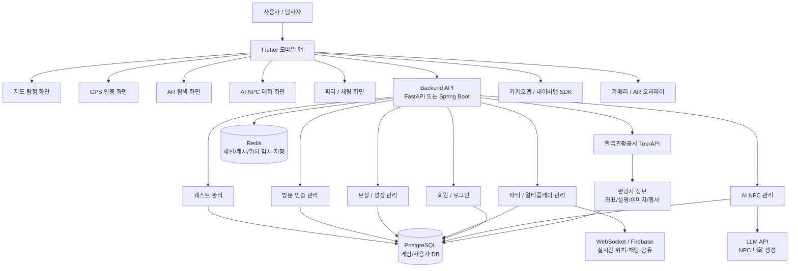

### 1. 전체 시스템 구조

```markdown
사용자
 ↓
관광지 방문 → GPS 인증 → 도깨비 NPC 등장 → 지역 스토리 진행 
→ AR 탐색 → 기억석 조각 획득 → 플레이어 성장 및 보상 획득 → 다음 관광지 개방 
→ 지역 기억석 복원
 ↓
챕터 완료
```

---

### 2. 앱 화면 흐름



앱 화면 흐름은 사용자가 관광지를 선택하고, 현장에서 인증하고, 스토리를 진행하고, 보상을 획득하는 구조로 구성한다.

#### 1) 시작 흐름

스플래시 화면

→ 서비스 소개

→ 로그인 / 회원가입

→ 튜토리얼

→ 탐사자 프로필 생성

→ 첫 지역 선택

→ 홈 화면 진입

튜토리얼에서는 플레이어가 ‘탐사자’로서 도깨비를 볼 수 있는 능력을 얻게 된 배경을 짧게 보여준다. 이후 첫 번째 지역으로 서울 종로 챕터를 추천하고, 사용자가 기본 게임 루프를 이해할 수 있도록 첫 퀘스트를 제공한다.

#### 2) 홈 화면

홈 화면은 사용자의 현재 진행 상태를 보여주는 중심 화면이다.

홈 화면에는 현재 탐사 등급, 진행 중인 지역 챕터, 수집한 기억석 조각 수, 오늘 추천 관광지, 진행 중인 퀘스트, 파티 상태, 시즌 이벤트 배너가 표시된다.

홈 화면 주요 메뉴는 다음과 같다.

- 지도 탐험
- 현재 퀘스트
- 도깨비 도감
- 기억석 보관함
- 희귀 유물
- 파티
- 시즌 이벤트
- 프로필

#### 3) 지도 탐험 화면

지도 탐험 화면은 TourAPI의 관광지 좌표 데이터를 기반으로 관광지를 지도 위에 표시하는 화면이다.

관광지는 상태에 따라 다르게 표시된다.

- 미개방 관광지
- 방문 가능 관광지
- 진행 중 관광지
- 완료 관광지
- 시즌 이벤트 관광지
- 파티 퀘스트 관광지

사용자가 관광지를 선택하면 관광지 정보, 거리, 예상 소요 시간, 연결 퀘스트, 획득 가능한 기억석 조각, 등장 NPC 정보를 확인할 수 있다.

#### 4) 관광지 상세 화면

관광지 상세 화면에서는 실제 관광지 설명과 게임 콘텐츠가 함께 제공된다.

표시 정보는 다음과 같다.

- 관광지명
- 주소
- 이미지
- 관광지 설명
- 관련 지역 스토리
- 등장 도깨비 NPC
- 획득 가능한 기억석 조각
- 획득 가능한 희귀 유물
- 방문 인증 버튼
- 길찾기 버튼

#### 5) GPS 인증 화면

사용자가 관광지 반경 안에 진입하면 GPS 인증이 가능해진다.

인증 기준은 관광지 특성에 따라 다르게 설정할 수 있다.

- 도심 관광지: 반경 50m
- 넓은 관광지: 반경 100m
- 자연 관광지: 반경 150m

GPS 인증이 완료되면 해당 관광지의 탐험 구역이 활성화되고 도깨비 NPC가 등장한다.

#### 6) NPC 대화 화면

NPC 대화 화면에서는 지역 수호 도깨비 또는 관광지별 도깨비와 대화한다.

NPC는 관광지 설명, 지역 스토리, 사용자의 진행 상황을 기반으로 대화를 제공한다. 사용자는 대화를 통해 현재 장소의 기억석 조각이 왜 훼손되었는지, 어떤 기억을 복원해야 하는지, AR 탐색에서 무엇을 찾아야 하는지 안내받는다.

#### 7) AR 탐색 화면

AR 탐색 화면에서는 카메라 화면 위에 게임 오브젝트가 표시된다.

초기 MVP에서는 실제 3D AR보다는 카메라 화면 위에 2D/3D 오브젝트를 오버레이하는 방식으로 구현한다.

AR 탐색 요소는 다음과 같다.

- 기억석 조각
- 도깨비 발자국
- 역사적 유물 잔상
- 숨겨진 관광지 힌트
- 시즌 한정 오브젝트

사용자가 오브젝트를 터치하면 단서 또는 기억석 조각을 획득한다.

#### 8) 보상 화면

퀘스트 완료 후 보상 화면이 표시된다.

보상 항목은 다음과 같다.

- 경험치
- 기억석 조각
- 도깨비 도감 등록
- 희귀 유물
- 칭호
- 지역 기억석 복원도 증가
- 다음 관광지 개방

#### 9) 챕터 완료 화면

지역별 기억석 조각을 모두 수집하면 지역 기억석이 복원된다.

이때 지역별 엔딩 컷신 또는 스토리 요약 화면을 제공한다. 사용자는 자신이 방문한 관광지, 만난 도깨비, 복원한 기억, 획득한 유물을 확인할 수 있다.

---

### 3. 퀘스트 구조

퀘스트는 메인 퀘스트, 관광지 퀘스트, 사이드 퀘스트, 파티 퀘스트, 시즌 퀘스트로 구분한다.

#### 1) 메인 퀘스트

메인 퀘스트는 지역 기억석 복원을 목표로 하는 핵심 시나리오이다.

예시: 서울 종로 챕터

경복궁 → 광화문 → 북촌한옥마을 → 창덕궁 → 지역 기억석 복원 → 챕터 완료

각 장소는 하나의 기억석 조각과 연결된다. 모든 기억석 조각을 수집하면 지역 기억석이 복원된다.

#### 2) 관광지 퀘스트

관광지 퀘스트는 특정 관광지에 도착해야만 진행할 수 있는 현장 기반 퀘스트이다.

구조는 다음과 같다.

관광지 도착 → GPS 인증 → NPC 등장 → 지역 스토리 대화 → AR 탐색 → 기억석 조각 획득 → 퀘스트 완료

#### 3) 사이드 퀘스트

사이드 퀘스트는 메인 스토리와 별도로 제공되는 보조 콘텐츠이다.

사용자의 관심 지역, 방문 이력, 시즌 이벤트, 주변 관광지 데이터를 기반으로 추천할 수 있다.

예시:

- 북촌 골목에 숨어 있는 장난 도깨비 찾기
- 광화문 주변의 사라진 기록 조각 수집
- 경복궁 야간 개장 시즌 한정 도깨비 만나기

#### 4) 파티 퀘스트

파티 퀘스트는 친구, 가족, 연인과 함께 여행할 때 사용할 수 있는 멀티유저 퀘스트이다.

최대 4인이 하나의 파티를 구성하고, 같은 지역 시나리오를 함께 진행한다. 파티원은 서로의 위치, 방문 기록, 획득한 기억석 조각을 공유할 수 있다.

파티 퀘스트 방식은 다음과 같다.

- 같은 관광지 동시 방문
- 파티원 중 1명이 발견한 기억석 조각 공유
- 각자 다른 관광지를 방문해 기억석 조각을 나누어 수집
- 파티 전용 기억석 획득
- 파티 업적 달성

#### 5) 시즌 퀘스트

시즌 퀘스트는 관광공사 축제 및 행사 데이터와 연계한다.

예시:

봄: 벚꽃 기억석 이벤트

여름: 해안 탐사 이벤트

가을: 단풍 기억 복원 이벤트

겨울: 설화·귀신 이야기 이벤트

시즌 퀘스트는 특정 기간에만 등장하며, 한정 NPC와 한정 유물을 제공한다.

---

### 4. NPC 시스템

NPC는 도깨비 세계관과 관광 데이터를 연결하는 핵심 장치이다.

NPC는 크게 수호 도깨비, 장소 도깨비, 시즌 도깨비, 파티 도깨비로 구분한다.

#### 1) 수호 도깨비

수호 도깨비는 각 지역 챕터를 대표하는 메인 NPC이다.

예시:

- 종로 수호 도깨비
- 경주 수호 도깨비
- 전주 수호 도깨비
- 부산 수호 도깨비
- 제주 수호 도깨비

수호 도깨비는 지역 전체의 문제 상황을 설명하고, 플레이어가 어떤 기억석 조각을 모아야 하는지 안내한다.

#### 2) 장소 도깨비

장소 도깨비는 특정 관광지에 등장하는 NPC이다.

예시:

- 경복궁 기록 도깨비
- 광화문 문지기 도깨비
- 북촌 골목 도깨비
- 창덕궁 후원 도깨비

장소 도깨비는 해당 관광지의 역사와 문화 정보를 바탕으로 대화하며, AR 탐색 미션을 안내한다.

#### 3) 시즌 도깨비

시즌 도깨비는 축제, 행사, 계절 이벤트와 연결된 한정 NPC이다.

예시:

- 벚꽃 도깨비
- 단풍 도깨비
- 바다 도깨비
- 설화 도깨비

#### 4) 파티 도깨비

파티 도깨비는 멀티 플레이에서 등장하는 NPC이다.

파티원들에게 공동 목표를 안내하고, 각 파티원의 진행 상황을 기반으로 힌트를 제공한다.

#### 5) AI NPC 대화 방식

AI NPC는 완전 자유 생성 방식이 아니라, 안전한 범위 안에서 생성하는 구조로 설계한다.

입력 데이터는 다음과 같다.

- 관광지 설명
- 지역 시나리오
- NPC 성격
- 현재 퀘스트 상태
- 사용자의 진행도
- 획득한 기억석 조각
- 파티 여부

출력 데이터는 다음과 같다.

- 지역 스토리 대사
- 퀘스트 안내
- AR 탐색 힌트
- 기억석 조각 설명
- 다음 관광지 안내

메인 스토리의 핵심 대사는 수동 작성하고, 일반 질문 응답과 힌트 제공은 AI가 생성하는 하이브리드 방식을 사용한다.

---

### 5. 보상 시스템

보상 시스템은 플레이어가 실제 관광지를 방문하고, 도깨비를 수집하고, 기억석을 복원하도록 유도하는 장치이다.

#### 1) 경험치

경험치는 탐사 등급을 올리는 기본 성장 재화이다.

획득 기준은 다음과 같다.

- 관광지 최초 방문
- GPS 인증 완료
- AR 탐색 완료
- NPC 대화 완료
- 기억석 조각 획득
- 지역 챕터 완료
- 파티 퀘스트 완료
- 시즌 퀘스트 완료

#### 2) 기억석 조각

기억석 조각은 메인 스토리 진행에 필요한 핵심 보상이다.

각 지역별 기억석은 약 5개의 기억석 조각으로 구성한다. 한 지역의 기억석 조각을 모두 모으면 지역 기억석이 복원되고 챕터가 완료된다.

#### 3) 도깨비 도감

도깨비 도감은 캐릭터 수집 요소이다.

사용자가 관광지를 방문하고 도깨비 NPC와 대화하면 해당 도깨비가 도감에 등록된다. 도감 완성도에 따라 경험치 보너스, 특별 칭호, 희귀 도깨비 등장 등의 보상을 제공한다.

#### 4) 희귀 유물

희귀 유물은 장비형 수집 요소이다.

유물은 특정 관광지, 특정 시간대, 특정 시즌에 등장할 수 있다. 유물은 AR 탐색 범위 증가, 특정 지역 경험치 증가, 역사 퀘스트 보상 증가와 같은 효과를 가진다.

#### 5) 칭호

칭호는 플레이어의 성취를 보여주는 명예 보상이다.

예시:

- 초급 탐사자
- 종로의 기억 복원자
- 팔도 도깨비 마스터
- 바람신의 탐사자
- 팔도 수호자

#### 6) 파티 보상

파티 보상은 멀티 플레이 참여를 유도하기 위한 보상이다.

예시:

- 파티 전용 기억석
- 파티 업적
- 공동 칭호
- 한정 유물
- 주간 파티 랭킹 보상