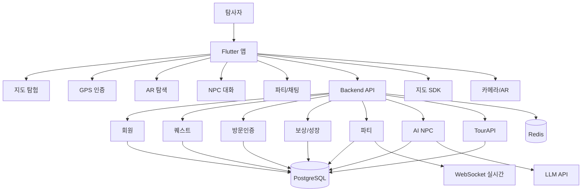

# 도깨비: 팔도의 비밀 — 통합 기획서

> 팀원 4개 문서(사용자 시나리오 kys·jch·ljs + 시스템 설계)를 하나로 합친 **정본(canonical)**.
> 원본은 `report/기획_*` 에 보존. 이 문서가 앞으로 갱신의 기준.

## 0. 통합 노트 — 출처 & 충돌 해소

| 영역 | 채택 출처 |
|---|---|
| 세계관·성장·수집·지역 시나리오 | ljs |
| 게임플레이 상태머신·NPC 합성공식·스키마·프롬프트·Edge Case | jch |
| 앱 화면 흐름·퀘스트/NPC 분류·보상 | 시스템설계 |
| 솔로/멀티 디테일·관광분산·맞춤/공용 시나리오·메이플 비유 | kys |

**충돌 해소**
1. **톤·장르**: ~~추리·사건(원본 kys)~~ → **탐험·수집 + 기억석 복원**(팀 3문서 합의). 추리는 "가벼운 힌트" 수준. *제안서의 "탐정 RPG"는 큰 틀 표현, 실제 메커닉은 탐험·수집임을 발표 시 명확히.*
2. **GPS 반경**: 도심 50m / 개방공간 100m / **자연 150m**.
3. **퀘스트 분류**: 목적별 5종(메인/관광지/사이드/파티/시즌) **×** 수행방식 4종(FIND/PHOTO/DIALOGUE/COLLECT) — 직교 축, 둘 다 사용.
4. **백엔드 스택/구조**: [아키텍처_파이프라인.md](./아키텍처_파이프라인.md)·[개발계획.md](./개발계획.md) 참조.

---

# Ⅰ. 세계관 & 스토리

## 1. 세계관 (ljs)

조선 건국 이전부터 한반도에는 각 지역의 기억과 역사를 수호하는 존재인 **팔도 수호 도깨비**가 있었다. 이들은 인간에게 모습을 드러내지 않은 채 지역의 전설·문화·역사적 기억을 보존해 왔다.

그러나 현대에 들어 지역 소멸과 관광 불균형이 심화되며 사람들의 기억에서 잊힌 장소가 늘었고, 그 결과 수호 도깨비들의 힘도 점차 약해졌다.

그러던 어느 날, 인간들의 기억에서 완전히 사라진 장소의 힘을 먹고 성장하는 존재인 **망각귀**가 나타난다. 망각귀는 전국 각지의 **기억석**을 훼손하기 시작했고, 지역의 역사와 설화가 왜곡되거나 사라질 위기에 처한다.

플레이어는 우연히 도깨비의 힘을 볼 수 있는 능력을 얻게 된 인간 **탐사자**로서, 팔도 수호 도깨비들과 함께 전국을 여행하며 기억석을 복원하고 망각귀의 음모를 막아야 한다.

> **관광은 단순한 이동이 아니라, 잃어버린 기억을 되찾는 여정이 된다.**

## 2. 플레이어 — 역할 & 목표 (ljs)

**역할 = 탐사자.** 현실에선 평범한 여행자지만, 특별한 능력으로 도깨비와 대화하고 인간들이 잊어버린 기억의 흔적을 본다. 각 지역 수호 도깨비로부터 의뢰를 받아 관광지를 탐험하고, 단서를 수집하며, 역사적 사실과 전설 속 진실을 밝혀낸다.

**최종 목표 = 전국 8개 대기억석 복원** → 팔도의 기억을 되살린다.
1. 실제 관광지를 방문하여 기억석 조각을 수집하고
2. 지역별 수호 도깨비와 협력하여 잃어버린 기억을 복원하며
3. 모든 대기억석을 완성하여 망각귀로부터 팔도의 기억을 지켜낸다

각 지역에 남겨진 역사·문화·설화를 직접 체험하며 기억을 되찾는 여정.

## 3. 핵심 게임 루프 & 상태 머신 (ljs + jch)

**루프**
```
관광지 방문 → GPS 인증 → 도깨비 NPC 등장 → 지역 스토리 진행
→ AR 탐색 → 기억석 조각 획득 → 플레이어 성장·보상 → 다음 관광지 개방
→ 지역 기억석 복원 → 챕터 완료
```
각 관광지에서 조각을 수집·복원하며 지역 이야기를 완성한다. 지역 기억석 복원이 끝나면 새 지역 시나리오가 개방되고, 최종적으로 전국 대기억석 복원이 목표.

**상태 머신** (jch)
```
[ARRIVED]         관광지 트리거 반경 진입
   │ GPS 인증 (도심 50m / 개방 100m / 자연 150m)
   ▼
[GPS_VERIFIED]    방문 인정 → 방문률+, 탐험 경험치+
   │ AR 카메라 실행
   ▼
[NPC_SPAWNED]     도깨비 NPC가 AR 오버레이로 등장 (최초 조우 시 도감 등록)
   ▼
[DIALOGUE]        NPC 대화(RAG 기반) → 퀘스트 수령
   ▼
[QUEST_ACTIVE]    퀘스트 타입별 수행 (1~2개 조합)
   │ 성공 조건 충족
   ▼
[QUEST_COMPLETE]  완료 검증
   ▼
[REWARDED]        보상: 경험치 / 기억석 조각 / 희귀 유물 / 도감
```
> **재방문**: 1회성 퀘스트가 이미 완료된 장소는 `[NPC_SPAWNED]`에서 **일상 대사 모드**로 분기(신규 퀘스트 미발급).

---

# Ⅱ. 사용자 시나리오

## 4. 장르·재미 포인트 (kys, 톤 조정)

> **"포켓몬 GO처럼 밖에 나가 돌아다니는데, 메이플스토리처럼 퀘스트 받고 NPC와 대화하고 친구랑 파티로 같이 도는 탐험·수집형 관광 RPG."**

핵심 둘:
1. **발로 움직여야 진행된다** — 실제 관광지 = 게임 맵, 실제 이동 = 게임 진행 조건
2. **혼자도 재밌고, 친구랑 하면 더 재밌다** — 솔로 탐험 ↔ 파티 협력

무거운 추리·퍼즐이 아니라 **탐험·수집·대화** 중심.

### 메이플스토리 대응표
| 메이플스토리 | 도깨비: 팔도의 비밀 |
|---|---|
| 사냥터 / 맵 | 실제 관광지 |
| 캐릭터 이동 | **내 실제 이동(GPS)** |
| NPC 퀘스트 수락 | 도깨비 NPC 대화로 의뢰 받기 |
| 몬스터 잡고 드랍 | AR 카메라로 단서·기억석 조각 수집 |
| 파티 퀘스트(파퀘) | 4인 협력(조각 분담 → 합동 복원) |
| 파티창/길드 채팅 | 실시간 파티 위치·조각 공유 + 인게임 채팅 |
| 보스 명성 / 레어 드랍 | **비인기 관광지의 희귀 유물·결정적 조각** |
| 도감 / 칭호 | 도깨비 도감·탐사 등급·칭호 |
| 시즌 이벤트 | 행사·축제 시즌 한정 퀘스트 |

## 5. 솔로 플레이 (kys + ljs)

싱글 플레이는 **스토리 중심 경험**에 초점. 본인 여행 일정에 맞춰 자유롭게 관광지를 방문하며 메인 시나리오와 사이드 퀘스트를 진행한다.

**AI NPC는 사용자의 진행 상황을 기억**하고, 이전 대화·방문 기록을 기반으로 개인화된 힌트를 제공한다. 예: 경복궁에서 획득한 단서가 북촌 한옥마을 퀘스트와 연결될 수 있고, 사용자의 선택에 따라 일부 대화와 엔딩이 달라진다.

### 예시 walkthrough — 종로 「경복궁의 사라진 어보」 (탐사자 지민)

**① 앱 실행 — "근처에 뭐가 있지?"**
- 안국역에서 내려 앱을 켠다. 지도에 현재 위치가 잡히고, 주변 관광지 위에 마커가 뜬다.
  - 🔵 **일반 조각** (경복궁·창덕궁 등 유명지)
  - 🟣 **희귀 조각** (운현궁·서울공예박물관 등 **사람 적은 곳** → 보상 가중치↑)
- 상단 챕터 배너: **「종로의 기억석 — 5조각 중 1개 복원됨」**

**② 첫 장소 도착 — GPS 인증 → 퀘스트 활성화**
- 운현궁 반경(개방공간 100m)에 진입 → 진동·알림: *"도깨비의 기척이 느껴진다…"*
- 방문 인정 → 방문률+, 탐험 경험치+. AR 카메라 실행.
- **장소 도깨비 등장**(최초 조우 시 도감 등록). 그 장소의 실제 역사 기반(RAG) 대사:
  > "여기가 흥선대원군이 살던 곳이라네. 헌데 어젯밤 이 땅의 기억 한 조각이 담장 어딘가로 숨어버렸지. 자네, 눈썰미가 좋은가?"
- 대화만 따라가도 운현궁이 어떤 곳인지 자연스럽게 알게 됨. NPC가 *왜 기억석이 훼손됐는지·무엇을 복원할지·AR로 뭘 찾을지* 안내.

**③ AR 탐색 — "어디 숨었지?"**
- "주변 둘러보기" → 카메라 실행. 현실 위에 **기억석 조각·도깨비 발자국·유물 잔상**이 떠 있다.
- 몸을 돌려 오브젝트를 화면 중앙에 맞추고 탭 → **조각 획득** + 단서: *"기억은 '더 오래된 곳'에 깃든다."*

**④ 단서 → 다음 장소 개방**
- 단서로 지도에서 창덕궁 마커가 해금된다. 지민은 실제로 창덕궁으로 걸어간다. (이 물리적 이동 = 게임 진행 = 관광 분산 유도)

**⑤ 복원 & 보상**
- 5개 장소를 돌며 조각을 모으면 **종로 기억석 복원**, 챕터 클리어 → 엔딩 컷신.
- 보상: 방문 관광지 도감 기록 / 비인기지(운현궁) 조각은 **희귀 유물 + 추가 경험치** / 칭호 "종로의 기억 복원자"
- "다음 기억은 북촌에서…" → 자연스러운 다음 동선.

> **솔로의 핵심 감정**: 내 발로 찾아낸 장소, NPC가 들려준 그곳의 이야기가 기억에 남는다.

## 6. 멀티 플레이 / 파티 (kys + ljs + 시스템설계)

멀티 플레이는 친구·가족·연인과 함께 여행하며 즐기는 구조. 최대 **4인** 탐사 파티.

**파티 기능**: 실시간 위치 공유 · 파티 채팅 · 기억석 조각 공유 · 공동 퀘스트 진행 · 관광지 방문 기록 공유 · 파티 업적.

### 6-A. 협력 모드 (조각 분담 → 합동 복원)
> 메이플 파퀘. 혼자선 못 깨는 걸 역할 나눠 같이.

**① 파티 구성** — 초대 코드/QR 공유 → 입장. 같은 지역 챕터에 함께 투입. 상단 파티창에 4명의 위치·상태·획득 조각 수가 실시간 표시.

**② 역할 분담 — "흩어져서 찾자"** — 한 지역의 기억석 조각이 여러 장소에 분산.
  - 지민 → 운현궁 / 친구A → 창덕궁 / 친구B → 북촌한옥마을 / 친구C → 서울공예박물관 *(일부러 비인기지에 핵심 조각)*
  - 각자 흩어져 동시에 AR 탐색. **획득 조각은 실시간으로 파티 전체에 공유**.

**③ 합동 복원 — "다 모여야 풀려"** — 마지막 복원은 **4명의 조각을 모두 모아야** 완성. 채팅으로 *"내 조각 '신시(申時)' 나왔는데 너넨?"* 맞춰가며 협력 → 전원 동시 클리어 → **공동 보상 + 파티 보너스**.

**④ 같이 있을 때의 재미** — 위치 공유로 실제로 만나 같이 다니기, 한 명이 헤매면 조각/힌트를 건네주기. 특정 지역은 **파티 플레이로만 획득 가능한 특별 기억석·한정 보상** 제공.

### 6-B. 경쟁 모드
- 같은 지역을 개별 동시 시작 → 먼저 조각 다 모아 복원한 사람 1등
- 실시간 **랭킹 리더보드**(현재 누가 몇 조각). 같은 장소 동시 도착 시 가벼운 선점 견제
- 지역별 기록 경쟁 · 주간 랭킹 · 시즌 이벤트 → 지속 참여 유도

---

# Ⅲ. 시스템 설계

## 7. 퀘스트 시스템 (시스템설계 × jch)

### 7-A. 목적별 5종 (시스템설계)

**① 메인 퀘스트** — 지역 기억석 복원을 목표로 하는 핵심 시나리오.
  - 예(종로): 경복궁 → 광화문 → 북촌한옥마을 → 창덕궁 → 지역 기억석 복원 → 챕터 완료. 각 장소가 하나의 조각과 연결, 모두 모으면 복원.

**② 관광지 퀘스트** — 특정 관광지에 도착해야만 진행하는 현장 기반.
  - 구조: 도착 → GPS 인증 → NPC 등장 → 지역 스토리 대화 → AR 탐색 → 조각 획득 → 완료.

**③ 사이드 퀘스트** — 메인과 별도 보조 콘텐츠. 사용자 관심지·방문이력·시즌·주변 데이터 기반 AI 추천.
  - 예: 북촌 골목에 숨은 장난 도깨비 찾기 / 광화문 주변 사라진 기록 조각 수집 / 경복궁 야간개장 시즌 한정 도깨비 만나기.

**④ 파티 퀘스트** — 멀티유저 전용(6절). 같은 관광지 동시 방문 / 1명 발견 조각 공유 / 각자 다른 곳 분담 수집 / 파티 전용 기억석 / 파티 업적.

**⑤ 시즌 퀘스트** — 관광공사 축제·행사 데이터 연계, 특정 기간만 등장. 한정 NPC·한정 유물(15절).

### 7-B. 수행 방식 4종 (jch) — 각 장소 인스턴스가 1~2개 선택
```
FIND_OBJECT    AR 화면 속 숨은 오브젝트를 탭하여 수집
PHOTO_MISSION  지정 대상이 화면에 들어오게 촬영 → 인증
DIALOGUE       NPC 질문에 선택지로 응답
COLLECT        지정 AR 아이템 N개 획득
```
> 기조: 무거운 추리·퍼즐 ❌ → **현장 탐색·수집·대화** 중심.

## 8. NPC 시스템 (시스템설계 분류 + jch 합성공식)

NPC는 도깨비 세계관과 관광 데이터를 잇는 핵심 장치.

### 8-A. 역할 분류 (시스템설계)
- **수호 도깨비** — 지역 챕터 대표 메인 NPC. 지역 전체 문제 설명, 어떤 조각을 모아야 하는지 안내. (종로/경주/전주/부산/제주 수호 도깨비)
- **장소 도깨비** — 특정 관광지 NPC. 그 장소 역사·문화로 대화하고 AR 미션 안내. (경복궁 기록 도깨비 / 광화문 문지기 도깨비 / 북촌 골목 도깨비 / 창덕궁 후원 도깨비)
- **시즌 도깨비** — 축제·행사·계절 한정. (벚꽃·단풍·바다·설화 도깨비)
- **파티 도깨비** — 멀티 전용. 공동 목표 안내, 파티원 진행 기반 힌트.

### 8-B. NPC 합성 공식 (jch) — TourAPI 1건 → 그 장소 고유 도깨비 1체를 **규칙으로** 생성
> 수작업 없이 확장 가능해야 함(제안서 "확장 비용 낮음").

**입력 (TourAPI)**: `title`, `contenttypeid`, `addr`, `overview`(장소 설명), `cat1/2/3`. 대표 인물·상징은 overview/title에서 추출.

**단계**
1. **모티프 추출** (우선순위 1개):
   ① 대표 역사 인물(overview/title에 인물명: 세종·이순신 등) → ② 상징물·건축(현판·해태상·석탑) → ③ 장소 기능(contenttypeid: 14/39=기능인, 32=주인, 사찰=수도자, 시장=상인) → ④ 자연·전설(바람·용·산신)
2. **아키타입 매핑** → 4종:
   - `persona`(인물형): 실존 인물 모티프, 업적·성격 반영
   - `guardian`(수호형): 건축·상징물 수호자, 위엄·과묵
   - `trade`(기능형): 상인/학예사/주인, 친근·수다
   - `spirit`(자연형): 자연·전설, 신비·변덕
3. **외형 합성**: 아키타입 base(뿔·방망이·한복 변형) + 모티프 시각요소. 예: 세종 → 곤룡포 변형 + 작은 뿔 + 붓 모양 방망이
4. **persona/말투**: 도깨비 공통 어미("~니라","허허","~겠느냐") + 모티프 색(세종=백성·글 강조, 자애)
5. **역할 고정**: 의뢰자(quest giver) 겸 그 장소 기억석 조각의 수호자
6. **대사 생성**: RAG로 overview/역사 주입 후 persona로 발화(13절 프롬프트)

**출력 NPC 객체**: `npc_id, name, archetype, motif, appearance_tags, persona, prompt_template_id, rag_source_ref(=tour_content_id)`

**자동화 수준**: 파일럿=모티프 큐레이션(수동 지정) → 확장기=overview LLM 추출 자동화. **모티프 추출 실패**(설명 빈약) 시 contenttypeid 기반 `trade`/`guardian` 기본값 fallback.

**담당 연계**: 페르소나 시드 저작·캐릭터 디자인 = 이지선 / 프롬프트·생성 품질 = 박준형 ([개발계획.md](./개발계획.md) AI 분담)

### 8-C. AI 대화 방식 — 하이브리드 (시스템설계)
완전 자유 생성 ❌ → **안전 범위 내 생성**. **메인 스토리 핵심 대사는 수동 작성**, 일반 질문 응답·힌트는 AI 생성.
- **입력**: 관광지 설명 · 지역 시나리오 · NPC 성격 · 현재 퀘스트 상태 · 사용자 진행도 · 보유 기억석 조각 · 파티 여부
- **출력**: 지역 스토리 대사 · 퀘스트 안내 · AR 탐색 힌트 · 기억석 조각 설명 · 다음 관광지 안내

## 9. 성장 · 수집 시스템 (ljs + 시스템설계)

전투가 아닌 **탐험과 수집**으로 성장. 탐험 = 실제 방문 + AR 현장 탐색. 수집 = 기억석·도깨비 도감·희귀 유물. 일부 희귀 수집품은 특정 계절·시간대·축제에만 등장(반복 방문 동기).

### 9-A. 탐사 등급 (대표 성장 지표 = RPG 레벨)
**경험치 획득 기준**
- 탐험 활동: 관광지 최초 방문 / AR 탐색 완료 / 숨겨진 관광지 발견
- 스토리 활동: 메인 퀘스트 완료 / 지역 챕터 완료 / 기억석 복원
- 수집 활동: 도깨비 등록 / 희귀 유물 획득 / 도감 완성

**등급 체계**
| 구간 | 등급 | 해금 |
|---|---|---|
| Lv1~10 | 초급 탐사자 | 기본 기능 |
| Lv11~30 | 숙련 탐사자 | 희귀 도깨비 등장 |
| Lv31~50 | 전문 탐사자 | 히든 관광지 개방 |
| Lv51~100 | 전설 탐사자 | 최종 시나리오 개방 |

### 9-B. 도깨비 도감 ("얼마나 수집했나")
수집: 관광지 방문 → NPC 발견 → 대화 → 도감 등록.
보상: **20%** 탐험 경험치 +5% / **50%** 특별 칭호 / **80%** 희귀 NPC 등장 / **100%** 팔도 도깨비 마스터.

### 9-C. 관광지 방문률 ("얼마나 여행했나")
`방문률(%) = 방문 관광지 수 ÷ 전체 관광지 수 × 100` (GPS 인증 + AR 탐색 완료해야 인정).
효과: 전국 지도 해금률 증가 · 신규 여행 루트 추천 · 지역 간 연결 퀘스트 개방 · 추가 경험치.
보상: **10%** 특별 프로필 배지 / **50%** 희귀 퀘스트 개방 / **100%** 팔도 수호자 업적.

### 9-D. 기억석 수집률 ("얼마나 스토리 진행했나")
각 지역 기억석 = 약 **5조각(장소)**. 게임 전체 진행도를 결정하는 가장 중요한 요소.
보상: **20%** 새 지역 개방 / **50%** 새 스토리 / **80%** 특별 NPC / **100%** 최종 엔딩.

### 9-E. 희귀 유물 ("어떤 능력을 갖나" = 장비형)
도감이 "캐릭터 수집"이면 유물은 "장비 수집". 탐험 능력을 강화. **조합·강화 가능, 세트 완성 시 추가 효과.**
| 지역 | 유물 | 효과 |
|---|---|---|
| 종로 | 조선 왕실 인장 복제품 | 역사 관련 퀘스트 보상 +10% |
| 경주 | 신라 금관의 파편 | (탐험 버프) |
| 제주 | 바람신의 부적 | AR 탐색 범위 +5% |
| 부산 | 용왕의 비늘 | 해안 지역 탐험 경험치 +15% |

### 9-F. 보상 종류 정리 (시스템설계)
경험치 · 기억석 조각 · 도깨비 도감 등록 · 희귀 유물 · 칭호 · 지역 복원도 증가 · 다음 관광지 개방.
- **칭호 예**: 초급 탐사자 / 종로의 기억 복원자 / 팔도 도깨비 마스터 / 바람신의 탐사자 / 팔도 수호자
- **파티 보상**: 파티 전용 기억석 / 파티 업적 / 공동 칭호 / 한정 유물 / 주간 파티 랭킹 보상

## 10. 관광 분산 메커니즘 ⭐ (kys + jch) — 제안서 핵심 목표

> **규제·홍보가 아니라 게임 보상으로 동선을 숨은 명소로 흐르게 한다.**

- 각 장소에 `density_tier` 라벨: `popular` / `low_traffic`
- **`low_traffic`(비인기)에 최고 희귀도 조각·유물 배치** → 결정적 보상을 위해 숨은 곳 방문
- 혼잡도/방문도 데이터 기반 **보상 가중치**(비인기일수록 ↑)
- 종로: 기획안 4개(인기) + **비인기 1슬롯**(운현궁/딜쿠샤/윤동주문학관 등 — 데이터 확인 후 확정)을 더해 5조각, **결정적 조각을 비인기지에 배치**
> 비인기 컷오프 기준(혼잡도 분포)은 EDA로 실측 ([개발계획.md](./개발계획.md))

## 11. 맞춤형 시나리오 + 공용화 ⭐ (kys)

> 사용자가 **가고 싶은 곳**을 미리 넣으면 살리되, 숨은 관광지 유도가 깨지지 않게. 그리고 그 루트를 **공용 콘텐츠로 승격**.

### 11-1. AI = "백지 창작"이 아니라 "검증된 블록 조립"
관광지를 **노드**로 미리 저장: `좌표 · 카테고리 · 설명/역사 텍스트 · NPC 페르소나 시드 · 조각 슬롯 · 혼잡도/인기 라벨`.
| 역할 | 누가 |
|---|---|
| 저장(DB) | 관광지 노드·단서 템플릿·NPC 시드 (검증된 재료) |
| 생성(AI) | 노드 **선택 + 배열** + 연결 스토리/대사 (백지 창작 ❌) |
→ 품질 통제 · 분산 통제 · 생성 결과 저장 = 재사용/공용 시나리오.

### 11-2. "앵커 + 샛길" 모델 (분산 목표 충돌 방지)
| | 역할 | 보상 |
|---|---|---|
| **앵커**(위시리스트, 유명지) | 루트의 **피날레/최종 목적지** | 일반 |
| **샛길**(시스템이 끼운 비인기지) | 앵커를 **해금하는 조각 장소** | **희귀(가중치↑)** |

**예시**: 위시리스트 "경복궁, 광장시장" 입력 → 「두 곳을 잇는 종로 탐사 코스」 생성: 운현궁(비인기·조각1) → 서울공예박물관(비인기·조각2) → 익선동(비인기·조각3) → **경복궁(피날레)** → 보너스 광장시장. *가고 싶던 곳은 가되, 사이 비인기지 3곳을 자연스럽게 거침.*

### 11-3. 생성 규칙(가드레일) — 어기면 거부/재생성
- ✅ 비인기지 노드 최소 N개 포함 · ✅ 위시리스트 비중 상한 · ✅ 비인기지 희귀 보상 가중치 유지 · ✅ 도보 동선 현실성
- ❌ 유명지만 줄줄이 → 자동 거부/보정 · ✅ 위시리스트 비면 100% 시스템 큐레이션(=공식 시나리오)

### 11-4. 공용화 라이프사이클
```
[개인 맞춤] → [자동검수: 규칙·동선·텍스트필터·본인완주] → [공용 풀: 플레이·평점·리믹스]
```
제안서 UGC 발전방향과 직결. (자동검수=통과/탈락 게이트, 평점·완주율=노출 순위)

### 11-5. 시나리오 3종
| 종류 | 만드는 주체 | 분산 통제 |
|---|---|---|
| 공식 | 운영 | 100% 큐레이션 |
| 맞춤 | 사용자 위시리스트 + AI | 생성 규칙(11-3) 강제 |
| 공용 | 맞춤 → 검수 승격 | 검수 통과분 |

### 11-6. 위시리스트 입력 UX
| 방식 | 언제 | 예 |
|---|---|---|
| 🔍 검색(메인) | 정확히 안다 | "경복궁" 자동완성 |
| 📍 지도 핀 | 지역만 정해짐 | 영역 지정 |
| 🏷️ 취향 태그 | 막연함 | #고궁 #먹거리 #한적한곳 |
| ⏭️ 건너뛰기 | 다 맡김 | 100% 시스템 큐레이션 |

+ **제약 칩**(시나리오를 더 좌우): ⏱️시간(2h/반나절/하루) · 🚶이동수단(도보/대중교통) · 👥동행(혼자/친구) · 🎚️난이도

### 11-7. 리믹스(fork) — 단계적 개방
| 레벨 | 바꾸는 것 | 공용 등록 조건 |
|---|---|---|
| L0 플레이 | (수정 없음) | — |
| **L1 장소 교체**(기본) | 앵커를 내 위시리스트로 swap | 규칙 자동 재검증 |
| L2 동선 조정 | 장소 추가/제거·순서·난이도 | 규칙 + 동선 검증 |
| L3 작가 모드 | 스토리·NPC 대사 수정 | 규칙 + 텍스트 필터·사실성 검수 |
> 어떤 레벨이든 11-3 규칙 재검증 + 원작자 크레딧·리믹스 계보(fork tree). L1 먼저 오픈 → L2/L3 순차.

### 11-8. 공용 시나리오 품질관리 — 게이트 + 평점(역할 분담)
- **등록 게이트(자동검수)**: 규칙 충족·동선 실현·부적절/부정확 텍스트 필터·작성자 본인 1회 완주
- **노출 조정(커뮤니티)**: 평점 · **완주율(동선 현실성의 진짜 지표)** · 즐겨찾기 · 신고 누적 시 자동 비공개·재검수
- 콜드 스타트: 신규는 "🆕 신규" 슬롯 노출 기회 / 신뢰 배지: 🤖자동통과 · 🔥인기 · ✅공식인증

## 12. 앱 화면 흐름 (시스템설계)



**1) 시작 흐름**: 스플래시 → 서비스 소개 → 로그인/회원가입 → 튜토리얼(탐사자 능력 각성 배경, 첫 퀘스트로 기본 루프 학습) → 탐사자 프로필 생성 → 첫 지역(종로 추천) → 홈

**2) 홈 화면**: 현재 진행 상태 중심. 표시 = 탐사 등급·진행 중 지역 챕터·수집 조각 수·오늘 추천 관광지·진행 퀘스트·파티 상태·시즌 배너.
메뉴 = 지도 탐험 · 현재 퀘스트 · 도깨비 도감 · 기억석 보관함 · 희귀 유물 · 파티 · 시즌 이벤트 · 프로필

**3) 지도 탐험**: TourAPI 좌표 기반 관광지 표시. 상태별 = 미개방 / 방문 가능 / 진행 중 / 완료 / 시즌 이벤트 / 파티 퀘스트. 선택 시 정보·거리·예상 소요시간·연결 퀘스트·획득 가능 조각·등장 NPC 확인.

**4) 관광지 상세**: 관광지명 · 주소 · 이미지 · 설명 · 관련 지역 스토리 · 등장 도깨비 · 획득 가능 조각·유물 · 방문 인증 버튼 · 길찾기.

**5) GPS 인증**: 반경(도심 50m / 넓은 곳 100m / 자연 150m) 진입 시 인증 가능 → 완료 시 탐험 구역 활성화 + 도깨비 등장.

**6) NPC 대화**: 관광지 설명·지역 스토리·진행 상황 기반. 왜 조각이 훼손됐는지·무엇을 복원할지·AR로 뭘 찾을지 안내.

**7) AR 탐색**: 카메라 위 오브젝트 오버레이(MVP는 2D/3D 오버레이). 요소 = 기억석 조각·도깨비 발자국·유물 잔상·숨겨진 관광지 힌트·시즌 한정 오브젝트. 터치 시 단서/조각 획득.

**8) 보상**: 경험치 · 기억석 조각 · 도감 등록 · 희귀 유물 · 칭호 · 지역 복원도 증가 · 다음 관광지 개방.

**9) 챕터 완료**: 지역 조각 전부 수집 → 기억석 복원 → 엔딩 컷신/요약. 방문 관광지·만난 도깨비·복원한 기억·획득 유물 확인.

## 13. 데이터 스키마 & RAG 프롬프트 (jch)

### 13-A. LocationQuest (전체)
```yaml
LocationQuest:
  quest_id: str
  tour_content_id: str          # TODO: TourAPI 바인딩 (데이터 담당)
  content_type_id: int          # 12 | 14 | 39 | 15 | 32
  coordinates:
    map_x: float                # TODO: TourAPI mapX
    map_y: float                # TODO: TourAPI mapY
  trigger_radius_m: int         # 50(도심) | 100(개방) | 150(자연)
  density_tier: str             # "popular" | "low_traffic" -> reward_weight 결정
  npc:
    npc_id: str
    name: str
    archetype: str              # persona | guardian | trade | spirit
    motif: str
    appearance_tags: [str]
    persona: str
    rag_source_ref: str         # = tour_content_id
    prompt_template_id: str
  quest:
    types: [QuestType]          # FIND_OBJECT | PHOTO_MISSION | DIALOGUE | COLLECT (1~2개)
    objective: str
    success_condition: str
    hint: str
  reward:
    exp: int
    memory_stone_fragment_id: str
    rare_relic_id: str | null   # 유물 시스템 연계 (선택/시즌 게이트)
    dex_entry: str              # 도깨비 도감 등록 키
```

### 13-B. RAG 프롬프트 템플릿 `npc_dialogue_v1`
```
[시스템]
너는 '{place_name}'을(를) 수호하는 도깨비 NPC '{npc_name}'다.
- 모티프: {motif}  - 아키타입: {archetype}  - 성격/말투: {persona}

[장소 실제 정보 — RAG 주입]
{tour_api_context}   # TourAPI overview, 역사·문화 설명

[규칙]
- 위 '장소 실제 정보'에 근거해서만 역사·문화를 말한다. 정보에 없으면 지어내지 않는다.
- 추리 유도가 아니라 '장소 소개 + 가벼운 힌트' 중심.
- 2~4문장. 도깨비 말투(어미 "~니라/~겠느냐", 감탄 "허허") 유지.
- 사용자 진행 단계({stage})에 맞는 대사만: 등장 / 의뢰 / 힌트 / 완료.

[컨텍스트]
- 사용자 진행상황: {player_state}   - 사용자 발화: {user_input}
```
placeholder는 런타임에 TourAPI·플레이어 상태로 치환. `{tour_api_context}`가 RAG 검색 결과 주입 지점.

---

# Ⅳ. 콘텐츠 & 운영

## 14. 지역별 시나리오 (ljs)

| 지역 | 챕터명 | 장소 | 줄거리 |
|---|---|---|---|
| **서울 종로** | 경복궁의 사라진 어보 | 경복궁·광화문·북촌한옥마을·창덕궁 (+비인기 1) | 왕실 수호 기억석이 사라지며 조선의 기록이 왜곡되기 시작. 사라진 어보의 행방을 추적. |
| **경주** | 천년왕국의 봉인 | 첨성대·동궁과 월지·불국사·석굴암 | 신라 수호 기억석 훼손, 고대 유적 기억이 사라짐. 천년 전 왕실의 비밀을 밝힘. |
| **전주** | 잊혀진 경기전의 기록 | 전주한옥마을·경기전·오목대 | 조선 왕조의 뿌리 경기전 기록이 사라짐. 잃어버린 기록을 복원. |
| **부산** | 용왕의 계약 | 태종대·해동용궁사 | 용왕 설화가 왜곡되기 시작. 바다 수호 도깨비와 진실 추적. |
| **제주** | 바람신의 유산 | 성산일출봉·용두암·비자림·해녀마을 | 제주 수호 기억석 파괴로 섬 곳곳 이상 현상. 바람신의 흔적을 찾음. |

> 파일럿 = **서울 종로**. 이후 지역은 NPC 합성 공식만 재적용 → 콘텐츠 제작비 최소화.

### 파일럿 NPC 인스턴스 — 광화문 「글빛 도깨비」 (jch 전체)
- archetype `persona` / motif 세종대왕·한글 / 외형 곤룡포 변형 + 작은 뿔 + 붓 모양 방망이
- persona: 백성과 글을 아끼는 자애롭고 학구적인 어조. 1인칭 "나", 어미 "~니라/~겠느냐"
- 퀘스트: `DIALOGUE` + `FIND_OBJECT` — 광화문 광장 일대에 흩어진 '잊힌 한글 자모 조각' 5개를 AR로 수집. hint: "현판을 올려다본 곳 근처…" (선택 PHOTO_MISSION: 현판이 화면에 들어오게 촬영)
- 보상: 탐험 경험치 + 종로 기억석 조각(1/5) + 희귀 유물 **조선 왕실 인장 복제품**(역사 퀘스트 보상 +10%) + 도감 등록

**단계별 대사 샘플**
- **등장**: "허허, 마침내 나를 볼 수 있는 눈을 가진 이가 왔구나. 나는 이 문을 오래도록 지켜온 도깨비니라."
- **의뢰**: "백성들이 글자를 잊으니 이 일대의 기억도 함께 흐려진다. 흩어진 글자 조각을 나와 함께 찾아주겠느냐?"
- **힌트**: "현판의 글씨를 올려다본 적 있느냐. 그 시선이 닿은 곳을 살펴보거라."
- **완료**: "장하다, 탐사자여. 잊혔던 글빛이 다시 돌아오는구나. 이 인장을 받거라. 이 땅의 기억을 지킨 증표이니라."

```yaml
# 스키마 인스턴스
quest_id: "jongno_gwanghwamun_01"
tour_content_id: "TODO_TOURAPI_BIND"
content_type_id: 12
coordinates: { map_x: 0.0, map_y: 0.0 }   # TODO: TourAPI
trigger_radius_m: 100                       # 광장 = 개방공간
density_tier: "popular"
npc:
  npc_id: "npc_gwanghwamun_sejong"
  name: "글빛 도깨비"
  archetype: "persona"
  motif: "세종대왕/한글"
  appearance_tags: ["곤룡포변형", "작은뿔", "붓방망이"]
  persona: "백성과 글을 아끼는 자애롭고 학구적인 도깨비 어조"
  rag_source_ref: "TODO_TOURAPI_BIND"
  prompt_template_id: "npc_dialogue_v1"
quest:
  types: ["DIALOGUE", "FIND_OBJECT"]
  objective: "흩어진 한글 자모 조각 5개 수집"
  success_condition: "collected_jamo == 5"
  hint: "현판 주변 탐색"
reward:
  exp: 100
  memory_stone_fragment_id: "jongno_stone_1of5"
  rare_relic_id: "relic_royal_seal"
  dex_entry: "글빛 도깨비"
```

## 15. 시즌 운영 (ljs + 시스템설계)

시즌은 현실 관광 데이터와 연계. 관광공사 축제·행사 데이터로 특정 기간에만 등장하는 NPC·한정 퀘스트를 자동 생성/만료 → 실제 관광 일정과 콘텐츠를 연결.
- 봄: 벚꽃 시즌 이벤트 / 여름: 해안 탐사 / 가을: 단풍 축제 / 겨울: 설화·귀신 이야기
- 시즌 도깨비 + 시즌 한정 유물 제공 → 반복 방문 동기

## 16. Edge Case (jch)

- **GPS 위조/오차**: 정확도 임계값·이동 속도 이상 탐지로 인증 신뢰도 확보
- **실내·음영 지역 GPS 부정확**: AR 인식 보조 인증 또는 반경 완화
- **모티프 추출 실패**(overview 빈약): contenttypeid 기반 `trade`/`guardian` 기본 아키타입 fallback
- **재방문 중복**: 1회성 완료 후 NPC 일상 대사 모드(신규 퀘스트 미발급)
- **멀티 동시성**: 4인이 같은 AR 오브젝트 탭 → 조각 중복/분배 동기화 규칙 ([아키텍처](./아키텍처_파이프라인.md) Redis 원자처리)
- **사진 미션 검증**: 온디바이스 분류 신뢰도·오인식 허용 범위
- **시즌 퀘스트**(contentTypeId 15): 기간 종료 후 만료 처리, 기간 데이터 부재 시 fallback
- **AR 미지원/저사양 기기**: 2D 대체 모드 fallback
- **비인기 핵심 장소 접근 불가**(영업 종료 등): 결정적 조각 회수 차단 → 대체 단서·우회 조건

## 17. 남은 결정 / TODO

- [ ] 제안서 "탐정" 표현 ↔ 실제 "탐험·수집" 톤 — 발표 메시지 정리
- [ ] 종로 비인기 1슬롯 확정 (운현궁/딜쿠샤/윤동주문학관 중 — TourAPI 데이터 확인)
- [ ] 모든 `TODO_TOURAPI_BIND`·좌표 = TourAPI 연동 시 바인딩 (데이터 담당)
- [x] ~~멀티턴 NPC 대화 여부 → LangGraph 도입 판단~~ → **결정: LangGraph 채택**(오케스트레이션 직접 구현 X, LangChain 풀세트는 미사용). 멀티턴 대화·분기 그래프로. ([아키텍처](./아키텍처_파이프라인.md) 6-2)
- [ ] 매직넘버(반경·보상 수치 등) 구현 시 상수화
