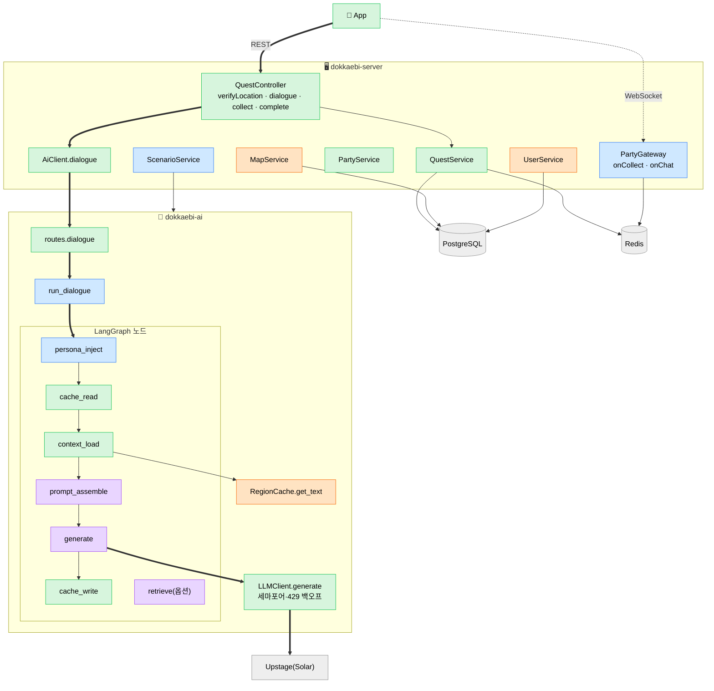
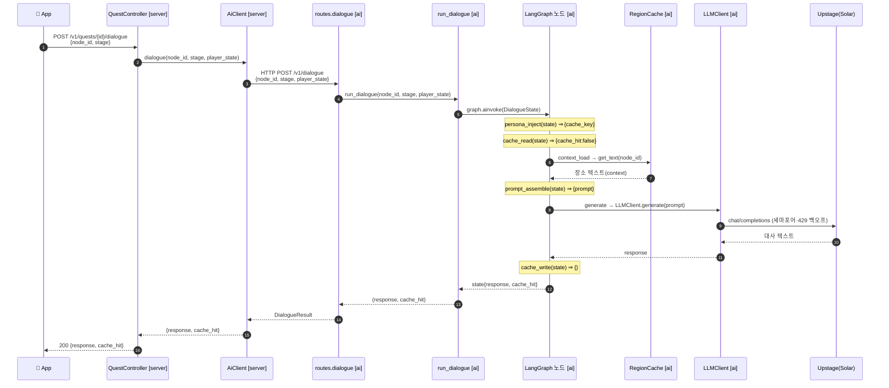
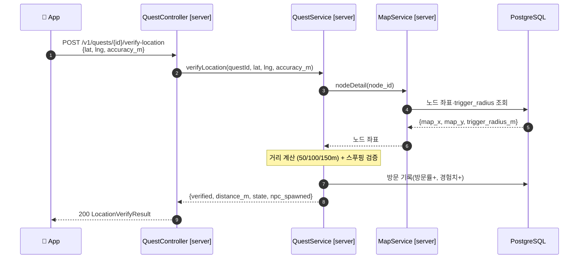
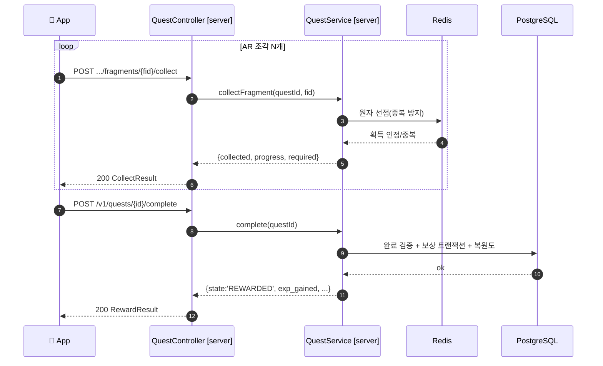
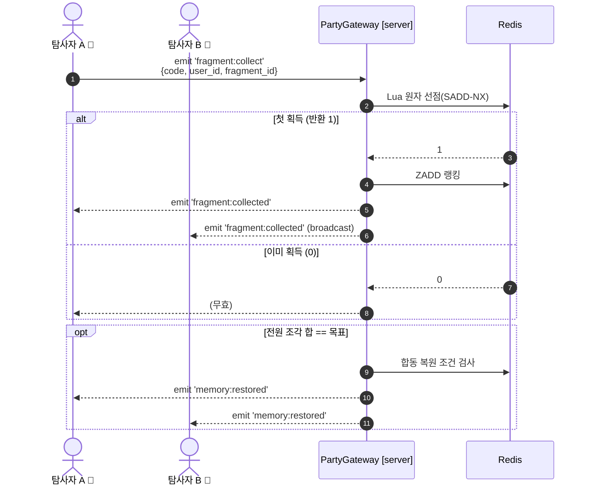
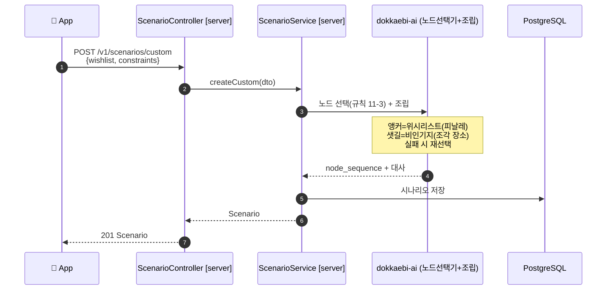
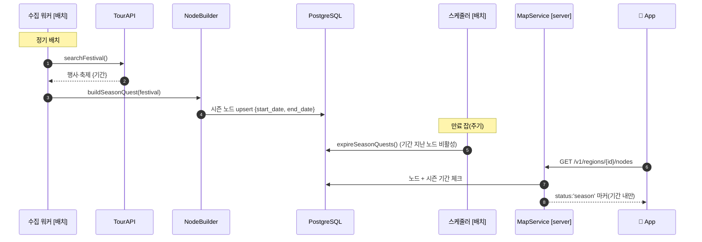
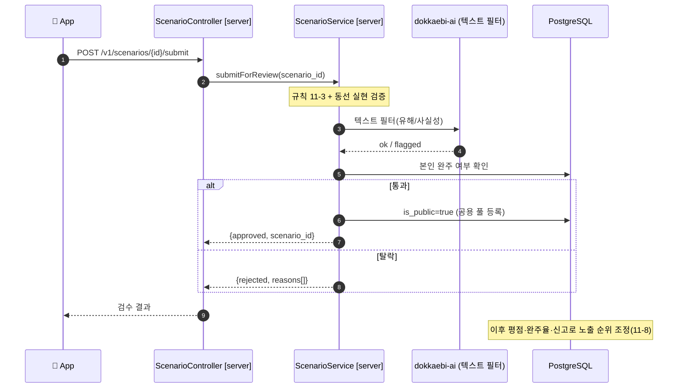
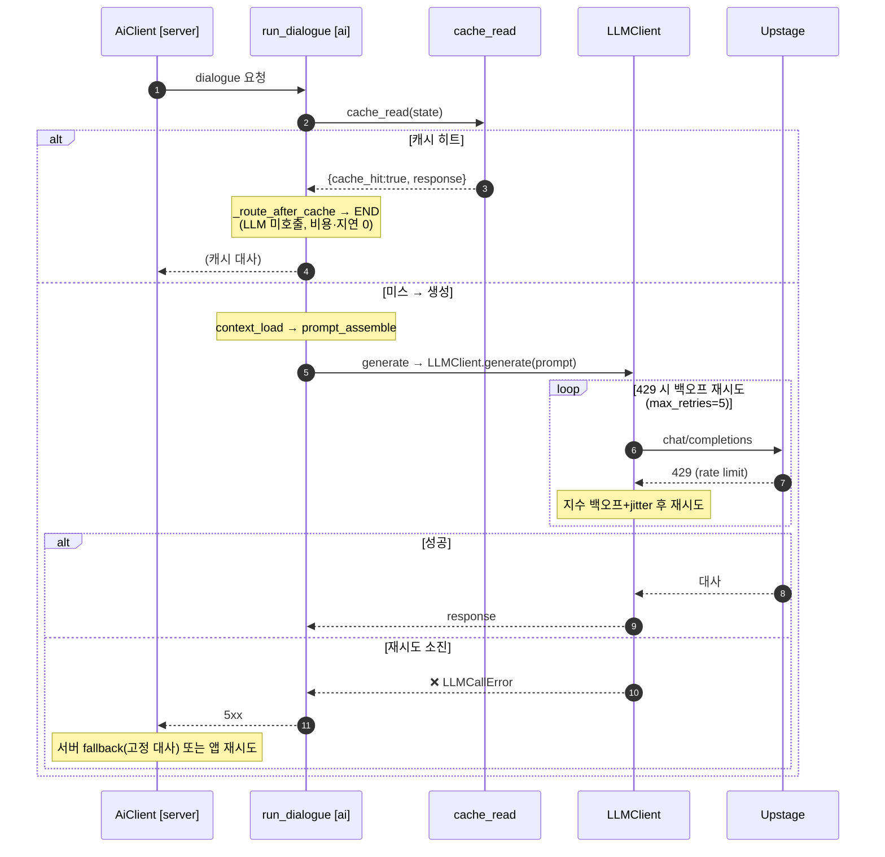

# 함수 콜링 시퀀스 (시나리오별)

> "사용자 요청이 **어떤 함수에 들어가 → 어떤 반환값으로 → 다음 어떤 함수로**" 흐르는지를 **실제 코드 함수명**으로 그린 문서.
> 컴포넌트 흐름은 [아키텍처_파이프라인.md](./아키텍처_파이프라인.md), 기능 정본은 [기획_통합.md](./기획_통합.md). 계약은 [contracts/server-openapi.yaml](../contracts/server-openapi.yaml).

## 표기법
- **참여자 = 실제 파일/클래스**: `QuestController`(server) · `AiClient`(server) · `run_dialogue`(ai) · `LangGraph 노드`(ai) · `LLMClient`(ai) …
- 화살표 라벨 = **호출 인자**, 점선(`-->>`) = **반환값**.
- `⇒` = 반환값, `[server]`/`[ai]` = 어느 백엔드.

---

## 0. 전체 함수맵 (발표용 1장) 🗺️

> 사용자 요청이 거치는 **모든 핵심 함수**를 한 장에. 색 = 담당자. 굵은 화살표 = NPC 대화 메인 흐름.



**담당자 색**: 🟦 김예슬(오케스트레이션·파티 Redis·시나리오) · 🟩 정찬희(앱·게임로직·서빙·배선) · 🟧 이지선(노드·유저 데이터) · 🟪 박준형(검색·프롬프트·생성)

> 📎 **슬라이드용 PNG**: [images/00-function-map.png](./images/00-function-map.png) · [images/01-npc-dialogue.png](./images/01-npc-dialogue.png) — 재생성법: [images/README.md](./images/README.md)

---

## 1. 솔로 — NPC 대화 (크로스 서비스 풀 체인) ⭐

> 가장 중요. 앱 → 게임서버 → AI → LangGraph 노드 → LLM(Upstage) → 거꾸로 반환.

### 1-A. 함수 체인 (한눈에)
```
[server] QuestController.dialogue(questId, DialogueDto)
  → AiClient.dialogue(node_id, stage, player_state)              ⇒ HTTP POST /v1/dialogue
    → [ai] routes.dialogue(DialogueRequest)
      → run_dialogue(node_id, stage, player_state)
        → graph.ainvoke(DialogueState):
            persona_inject(state)     ⇒ {cache_key}
            cache_read(state)         ⇒ {cache_hit: false}                (miss → 계속)
            context_load(state)       ⇒ {context}   ← RegionCache.get_text(node_id)
            prompt_assemble(state)    ⇒ {prompt}
            generate(state)           ⇒ {response}  ← LLMClient.generate → Provider → Upstage
            cache_write(state)        ⇒ {}
        ⇐ (response, cache_hit)
    ⇐ DialogueResult{response, cache_hit}
  ⇐ 200 {response, cache_hit}
```

### 1-B. 시퀀스 다이어그램


> 캐시 히트면: `cache_read` 가 `{cache_hit:true, response}` 반환 → `_route_after_cache` 가 **END로 분기** → context_load~generate 스킵(LLM 미호출). (아키텍처 3-1)

---

## 2. 솔로 — GPS 위치 인증 (ARRIVED → GPS_VERIFIED)

### 2-A. 함수 체인
```
[server] QuestController.verifyLocation(questId, LocationVerifyDto{lat,lng,accuracy_m})
  → QuestService.verifyLocation(questId, lat, lng, accuracy_m)
      → MapService.nodeDetail(node_id)   [TODO 이지선] ⇒ {map_x, map_y, trigger_radius_m}
      → (거리 계산 + 스푸핑 검증) [TODO 정찬희]
      → (방문 기록 저장: 방문률+, 경험치+) [TODO]
  ⇐ {verified, distance_m, state:'GPS_VERIFIED', npc_spawned, reason}
```

### 2-B. 시퀀스

> 실패 시(`verified:false`): 반경 밖/이동속도 이상 → `reason` 채워 반환, `npc_spawned:false`.

---

## 3. 솔로 — 조각 획득 → 완료/보상 (QUEST_ACTIVE → REWARDED)

### 3-A. 함수 체인
```
조각 획득(반복 N회):
[server] QuestController.collect(questId, fragmentId)
  → QuestService.collectFragment(questId, fragmentId)
      → (Redis 원자 선점: 중복 방지) [TODO 정찬희]
  ⇐ {fragment_id, collected, already_collected, progress, required}

완료:
[server] QuestController.complete(questId)
  → QuestService.complete(questId)
      → (success_condition 검증) → (보상 트랜잭션) → (지역 복원도 갱신) [TODO 정찬희]
  ⇐ {state:'REWARDED', exp_gained, memory_stone_fragment_id, rare_relic_id, titles, region_restored, next_node_id}
```

### 3-B. 시퀀스


---

## 4. 멀티 — 협력 조각 동기화 (Socket.io + Redis 원자처리)

> REST 아님. WebSocket 이벤트 → 게이트웨이 메서드 → Redis 원자 → 파티 broadcast.

### 4-A. 함수 체인
```
[server] (소켓) 'fragment:collect' {code, user_id, fragment_id}
  → PartyGateway.onCollect(body)
      → (Redis Lua 원자 선점: 없으면 1, 있으면 0) [TODO 김예슬]
      → (성공 시) ZADD 랭킹
  → server.to('party:{code}').emit('fragment:collected', {user_id, fragment_id})   ⇒ 파티 전원 수신
  → (전원 조각 합 == 목표) → emit('memory:restored', {region_id})
```

### 4-B. 시퀀스

> 중복 획득(lost update) 방지가 핵심 → `onCollect` 안에서 **Redis Lua로 check-and-set 원자 실행**. (아키텍처 4절)

---

## 5. 맞춤 시나리오 생성 (위시리스트 → 앵커+샛길)

### 5-A. 함수 체인
```
[server] ScenarioController.custom(CustomScenarioDto{wishlist, constraints})
  → ScenarioService.createCustom(dto)
      → (AI 노드 선택기 호출) [TODO]
          → [ai] 규칙 11-3 검증 루프(앵커=위시리스트, 샛길=비인기지)
          → LangGraph 조립(연결 스토리·대사)
      → (시나리오 DB 저장)
  ⇐ {scenario_id, title, node_sequence[], anchor_node_id, is_public}
```

### 5-B. 시퀀스


---

## 6. 시즌 퀘스트 — 자동 생성/만료 (배치, user-request 아님)

> 사용자 요청이 아니라 **배치/스케줄**(아키텍처 9절 — 워커/Lambda). 행사·축제 기간으로 시즌 퀘스트를 자동 생성하고 기간 지나면 만료.

### 6-A. 함수 체인
```
[배치] 수집 워커
  → TourAPI.searchFestival()                  ⇒ 행사·축제 {기간 start/end}
  → NodeBuilder.buildSeasonQuest(festival)    ⇒ 시즌 노드 {start_date, end_date}
  → DB upsert
[스케줄] expireSeasonQuests()                  → 기간 지난 시즌 노드 비활성
[런타임] MapService.nodesByRegion(region)      → (오늘 ∈ 기간?) ⇒ status:'season' 마커 노출
```

### 6-B. 시퀀스

> 담당: 수집/노드빌더 = 이지선·박준형(데이터) / 스케줄 = 인프라. 기간 데이터 부재 시 fallback(기획 16절).

---

## 7. 공용 시나리오 검수 (개인 → 공용 풀)

> 내 맞춤 시나리오를 제출 → **자동검수 게이트**(규칙 11-3·동선·텍스트필터·본인완주) → 통과 시 공용 풀 등록. (기획 11-8)

### 7-A. 함수 체인
```
[server] ScenarioController.submit(scenario_id)            ※ 추가 예정(계약 확장)
  → ScenarioService.submitForReview(scenario_id)
      → 규칙 11-3 재검증 + 동선 실현 검증
      → 텍스트 필터(유해/사실성)        ← dokkaebi-ai 호출 가능
      → 본인 완주 여부 확인
  통과 ⇒ is_public=true (공용 풀 등록)
  탈락 ⇒ {rejected, reasons[]}
[이후] 노출 조정: 평점·완주율·신고 (커뮤니티)
```

### 7-B. 시퀀스

> 담당: 흐름·게이트 = 김예슬 / 텍스트 필터 = 박준형. `submit`·`submitForReview`는 **추가 예정**(OpenAPI 계약에 반영 필요).

---

## 8. 엣지 / 실패 분기 (시나리오별) ⚠️

> 정상 흐름만큼 중요한 "안 될 때". 어디(함수)서 잡고 어떻게 처리하는지.

### 8-1. NPC 대화 — 캐시 · 429 · AI 다운



| 엣지 | 잡는 함수 | 처리 |
|---|---|---|
| 캐시 히트 | `cache_read` → `_route_after_cache` | END 분기, LLM 스킵(비용↓) |
| LLM 429 | `LLMClient._call_with_retry` | 지수 백오프+jitter 재시도(max 5) |
| 재시도 소진 | `LLMClient` → `LLMCallError` | `AiClient.dialogue` throw → server 5xx → 앱 fallback |
| 검색 저신뢰(옵션 RAG) | `retrieve` → confidence 평가 | 쿼리 재작성 후 재검색(max 2) |
| AI 서버 다운/타임아웃 | `AiClient.dialogue`(HTTP) | 서버가 503 또는 고정 대사 fallback |

### 8-2. GPS 인증 — 반경밖 · 스푸핑 · 실내

| 엣지 | 잡는 함수 | 처리 |
|---|---|---|
| 반경 밖 | `QuestService.verifyLocation`(거리계산) | `{verified:false, reason:"too_far"}`, npc_spawned:false |
| 스푸핑 의심 | `verifyLocation`(이동속도·정확도 교차검증) | `{verified:false, reason:"spoof_suspected"}` → 재시도 유도 |
| 실내/음영(정확도 큼) | `verifyLocation`(accuracy_m 체크) | 반경 완화 또는 AR 보조 인증 |
| 이미 완료 퀘스트 재방문 | (퀘스트 상태 조회) | NPC 일상 대사 모드(신규 퀘스트 미발급) |

### 8-3. 조각 획득 / 멀티 — 중복 · 재접속

| 엣지 | 잡는 함수 | 처리 |
|---|---|---|
| 동시 중복 획득(lost update) | `PartyGateway.onCollect` → Redis Lua | check-and-set 원자 → **한 명만 1**, 나머지 `already_collected:true` |
| 솔로 조각 중복 | `QuestService.collectFragment` → Redis | 원자 선점, 중복이면 무효 |
| 소켓 연결 끊김/재접속 | (gateway 재연결) | `party:join` 재호출 → `party:state` 재동기화 |
| 접근 불가 비인기 핵심 장소 | (서버 정책) | 대체 단서/우회 조건(기획 16절) |

### 8-4. 맞춤 시나리오 — 규칙 실패 · 빈 위시리스트

| 엣지 | 잡는 함수 | 처리 |
|---|---|---|
| 규칙 11-3 위반(비인기 부족 등) | AI 노드 선택기(검증 루프) | 노드 재선택(max N) |
| 재선택도 실패 | `ScenarioService.createCustom` | 시스템 큐레이션 fallback |
| 위시리스트 빔 | `createCustom`(분기) | 100% 시스템 큐레이션(=공식) |

---

## 부록 — 담당자별 "내가 채울 함수"
| 담당 | 채울 함수(시그니처는 이미 있음) |
|---|---|
| **정찬희** | `QuestService.verifyLocation/collectFragment/complete`(게임 로직·거리계산), `PartyService.*`, 앱 호출부 |
| **이지선** | `MapService.nodesByRegion/nodeDetail`·`UserService.me`(데이터 조회), `dokkaebi-ai` 노드: persona 시드·임베딩 |
| **박준형** | `dokkaebi-ai` 노드: `retrieve`/`prompt_assemble`/`generate`(품질·프롬프트·RAG) |
| **김예슬** | `PartyGateway.onCollect`(Redis 원자처리)·오케스트레이션·시나리오 흐름 |

> 함수 시그니처/반환 타입은 OpenAPI 계약 + 코드 헤더 주석과 일치. 본문만 채우면 위 시퀀스대로 동작.
