# 도깨비: 팔도의 비밀 — 아키텍처 & 데이터 파이프라인

> 기능 정본 = [기획_통합.md](./기획_통합.md). 용어(기억석 조각·탐사자·탐험·수집)·섹션 번호는 통합본 기준. 역할 분담은 [개발계획.md](./개발계획.md).
>
> 핵심 관점 두 가지
> 1. **TourAPI(OpenAPI) 데이터를 어떻게 "게임 재료"로 변환하는가** — 조회용 데이터 → 노드/기억석 조각/시즌퀘스트
> 2. **AI를 어느 단계에서 쓰는가** — 백지 창작 ❌ → ① 시나리오 조립 ② 런타임 NPC 대화(RAG·LangGraph)

**문서 구성**: 0 컨텍스트 → 1 빌드타임 → 2~4 런타임(솔로·NPC·멀티) → 5 맞춤생성 → 6 공용화 → 7 요약 → 8 백엔드 내부(담당자) → 9 배포

---

## 0. 시스템 컨텍스트 (큰 그림)

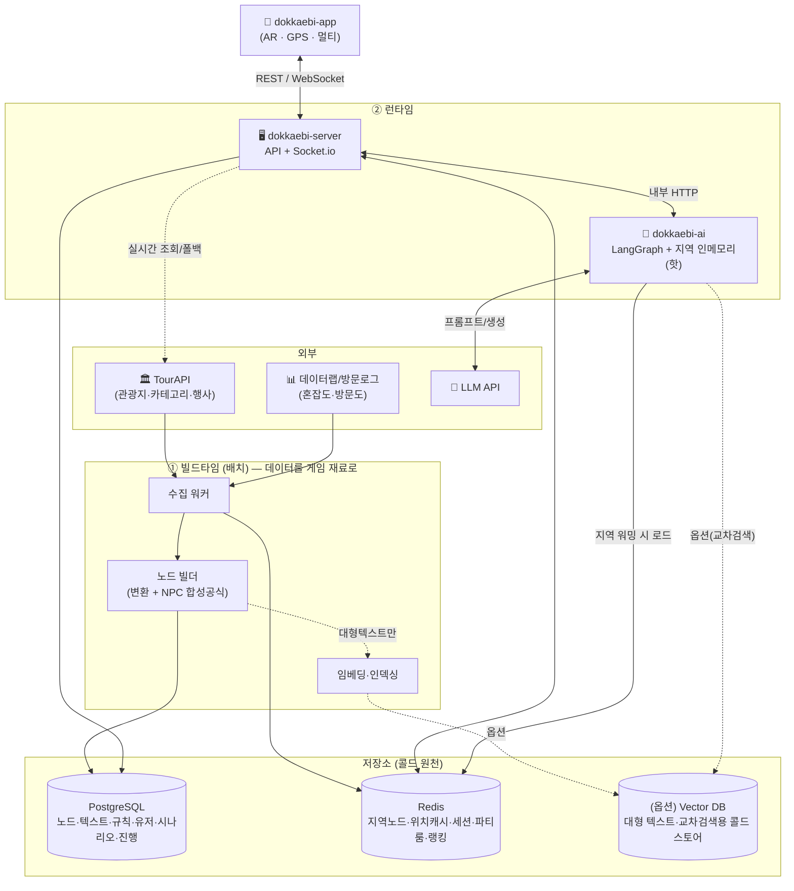

> **분리선**: 무겁고 정확성이 중요한 일(수집·변환·규칙화)은 **빌드타임에 저장**, 창의·맥락이 필요한 일(조립·대화)만 **런타임 AI**. TourAPI는 "노드의 재료", AI는 "노드를 이야기로 엮는 손".
>
> **데이터 처리 2원칙** (1-1·1-2 상세): ① **퀘스트 로직 = 규칙**(임베딩 0) / **대화 = 그 장소 텍스트 직접 주입**(RAG·임베딩은 옵션). ② 런타임은 **지역을 RAM에 올려 서빙**(존 서버 패턴), Vector DB는 콜드/옵션으로 강등.

---

## 1. 빌드타임 파이프라인 — TourAPI → 게임 재료

> 제안서 3-step(수집·저장 → 게임 구조 변환 → AI 재료화)을 실제 흐름으로.

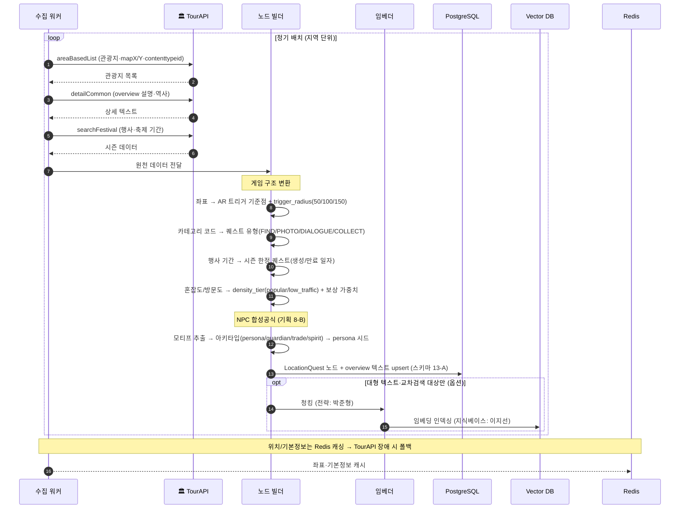

**포인트**
- 배치 수집 + 실시간 조회 병행, 위치는 Redis 캐싱(폴백)
- 결과물 = **관광지 노드**(이후 모든 시나리오·NPC 대사의 재료). **overview 텍스트는 DB에 그대로 저장**(런타임 직접 주입용) — 임베딩은 기본 아님
- 혼잡도는 TourAPI 코어에 없을 수 있음 → **데이터랩/자체 방문 로그**로 보완 (TODO: 데이터 소스 확정)

### 1-1. 데이터 처리 원칙 — 규칙 + 직접 주입 우선, 임베딩은 지역 한정(의미검색만)

> **핵심: 퀘스트 로직(규칙) ↔ 대화 grounding(텍스트)을 분리.** "전부 임베딩"하지 않는다. 그래서 임베딩 용량/수집 부담 자체가 거의 사라진다.

**① 퀘스트 로직 = 100% 규칙 (임베딩 0)**
- 퀘스트 유형(FIND/PHOTO/DIALOGUE/COLLECT) ← `contenttypeid` 규칙
- NPC 아키타입(persona/guardian/trade/spirit) ← 합성공식 규칙
- 보상 가중치·trigger_radius·시즌 ← 규칙
- → 전부 결정적, **노드 필드에 저장**. 벡터 불필요.

**② NPC 대화 grounding = "그 장소 텍스트 직접 주입"이 기본, 임베딩은 의미검색 한정**
- 한 NPC는 자기 장소 얘기만 함 → 그 장소 `overview`(수백~수천 자)를 **프롬프트에 통째로 주입**. 단일 장소 대화엔 **벡터 검색 불필요**.
- **임베딩(Tier 1, 확정)**: ⓐ 텍스트가 컨텍스트 한도 초과 시 청킹 검색, ⓑ **의미검색 기능**(교차검색·자유 위시리스트, 기획 11-10)에서만. **지역 한정 인메모리 numpy 인덱스 1개**(전국 벌크 ❌, Vector DB ❌).

**③ 콜링 = 지연(lazy) 온디맨드 + persist-on-touch**
```
장소 도착 → 노드 텍스트 가져옴(Redis/DB 캐시 → 없으면 TourAPI on-demand 1콜)
         → 프롬프트 직접 주입 → 대사 생성 → 결과/텍스트 캐시(다음 방문자 콜 0)
```
- 활성 지역(종로→확장): 사전 워밍 / 롱테일(전국 나머지): 첫 방문 때만 fetch+캐시 → **사전 벌크 임베딩·수집 불필요**
- **persist-on-touch = 점진 적재**: 온디맨드로 받은 노드는 즉시 **우리 DB에 영구 저장**(단순 휘발 캐시 아님). TourAPI는 "원천", 우리 DB는 "게임이 신뢰하는 사본" — 외부 데이터 변경·장애·rate limit에도 시나리오 재사용·공유·멀티가 일관. → **전국 eager 적재 ❌ / 매번 라이브 호출 ❌ / 건드린 것만 저장 ✅**
- **좌표 해석 = 카카오맵**: 앵커("꼭 가고싶은곳")·시작/끝 위치는 카카오 로컬검색으로 좌표화 → 그 좌표로 우리 DB 매칭(없으면 TourAPI fetch+저장). TourAPI에 없는 비관광지 앵커는 **좌표-only 피날레로 degrade**.

> 결과: ⓐ 전국 임베딩 GB 걱정 → **활성 지역만** 인덱싱(직접주입 기본 + 의미검색용 인덱스 1개, 전국 벌크는 여전히 ❌) / ⓑ 전국 벌크 수집 부담 → 방문된 곳만 받음. *진짜 신경 쓸 비용·지연은 런타임 LLM 호출* → 캐시·동시성으로 관리(3·4절).

### 1-2. 런타임 데이터 계층 — 지역 인메모리 (존 서버 패턴)

> 게임 서버이므로 **locality(국소성)** 를 쓴다. 한 세션의 워킹셋 = 지금 있는 지역 하나 → **그 지역만 RAM에 올려 서빙**. 디스크 벡터DB를 매번 때리지 않는다.

```
콜드(원천)   PostgreSQL(노드·텍스트·규칙)  [+ (옵션) Vector DB = 콜드 스토어]
   ↓ 지역 진입 시 워밍
웜(공유)     Redis (지역 노드·세션·파티 룸 상태) — 인메모리, 인스턴스 간 공유
   ↓ 핫셋 로드
핫(초고속)   AI 서버 프로세스 RAM — 활성 지역 텍스트 (+옵션: 소형 임베딩 numpy)
```

- **워밍**: 지역 진입(또는 부팅 시 파일럿 지역 pre-warm) → 그 지역 워킹셋을 RAM에. 이후 대화는 RAM에서 직접 주입/검색 → 디스크·네트워크 왕복 0.
- **용량**: 종로 ~20곳 ≈ 수십~수백 KB, 서울 ~2천곳 다 올려도 ≈ ~40MB → 인스턴스 하나에 여러 지역 상주 가능.
- **검색**: 지역 단위면 벡터 수십~수천 → 필요 시 **인메모리 brute-force 코사인(numpy)** 마이크로초. **디스크 ANN 인덱스 불필요**(ANN은 10⁵~10⁶ 벡터↑에서 의미).
- **챙길 것**: ⓐ 인프로세스 RAM은 휘발성·인스턴스별 → **읽기 캐시**(원천=DB, 미스 시 리빌드) ⓑ **LRU 제거**로 워킹셋 bound ⓒ 정적 텍스트라 무효화는 TTL/버전 bump ⓓ 실시간 멀티 동시성은 여전히 **Redis 원자처리**(4절).
- **트레이드오프**: 유저가 여러 지역에 흩어지면 인스턴스마다 다중 지역 적재 → **지역 기반 샤딩**(같은 지역 유저를 같은 인스턴스로, MMO 존 서버식)이 이상적. 초기엔 단일 인스턴스 + LRU로 충분.

> 한 줄: **"지역을 존처럼 RAM에 올려 서빙, 디스크 벡터DB는 콜드/옵션."**

### 1-3. 미리 적재 경계선 & 우선순위 (무엇을 빌드타임에 vs 온디맨드)

> **미리 적재 = "활성 지역(파일럿 종로) × 관광지(contenttypeid 12)" 만.** 그 외 전 지역·타 콘텐츠타입(식당 39·카페 등)은 lazy(첫 방문 fetch+저장). 식당/카페는 나중 확장.

**적재 우선순위** — 시나리오 흐름이 요구하는 순서대로(앞이 없으면 뒤가 안 돎):

| 순서 | 미리 적재 | 푸는 흐름 | 데이터 소스 | 담당 |
|---|---|---|---|---|
| 1️⃣ | **노드 기본**(node_id·좌표·addr1/2·카테고리·명칭) | 후보 조회·거리·배열 | 기초지자체 관광지 정보 | 이지선 |
| 2️⃣ | **집중률 → density_tier**(인기/비인기 라벨) | 앵커+샛길 선택(분산) | 집중률 + 박준형 EDA 컷오프 | 박준형→이지선 |
| 3️⃣ | **grounding 텍스트**(overview + 오디오가이드 대본) | NPC 대사·스토리(환각 방지) | 오디오가이드 정보 | 이지선 |
| 4️⃣ | **NPC 페르소나 시드**(아키타입·모티프·말투) | 대사 품질 | 저작 + 8-B 합성공식 | 이지선 |
| 5️⃣ | **임베딩 인덱스**(나중) | 의미검색 ②③(11-10) | 3️⃣ 텍스트 임베딩 | 이지선·박준형 |

- **1️⃣2️⃣3️⃣까지면 시나리오 생성이 끝까지 돈다.** 4️⃣=품질, 5️⃣=M2~M3 기능.
- ⚠️ **2️⃣(비인기 라벨)가 의외로 일찍 필요** — 분산이 핵심이라 라벨 없으면 "샛길"을 못 골라 규칙 11-3이 작동 안 함. EDA 컷오프 표본은 종로보다 넓게(서울/전국 집중률 통계) 보되 운영 적재는 종로만.
- **M1(종로 1퀘스트)**: 풀 적재 불필요 → **핵심 노드 3~5개만 1️⃣~4️⃣까지 채워** 수직 슬라이스 관통. 종로 전역 적재는 M2(노드 빌더 확장).

---

## 2. 런타임 A — 솔로 게임플레이 전체 (도착 → 보상)

> 상태머신 `[ARRIVED]→[GPS_VERIFIED]→[NPC_SPAWNED]→[DIALOGUE]→[QUEST_ACTIVE]→[QUEST_COMPLETE]→[REWARDED]` 을 시퀀스로.

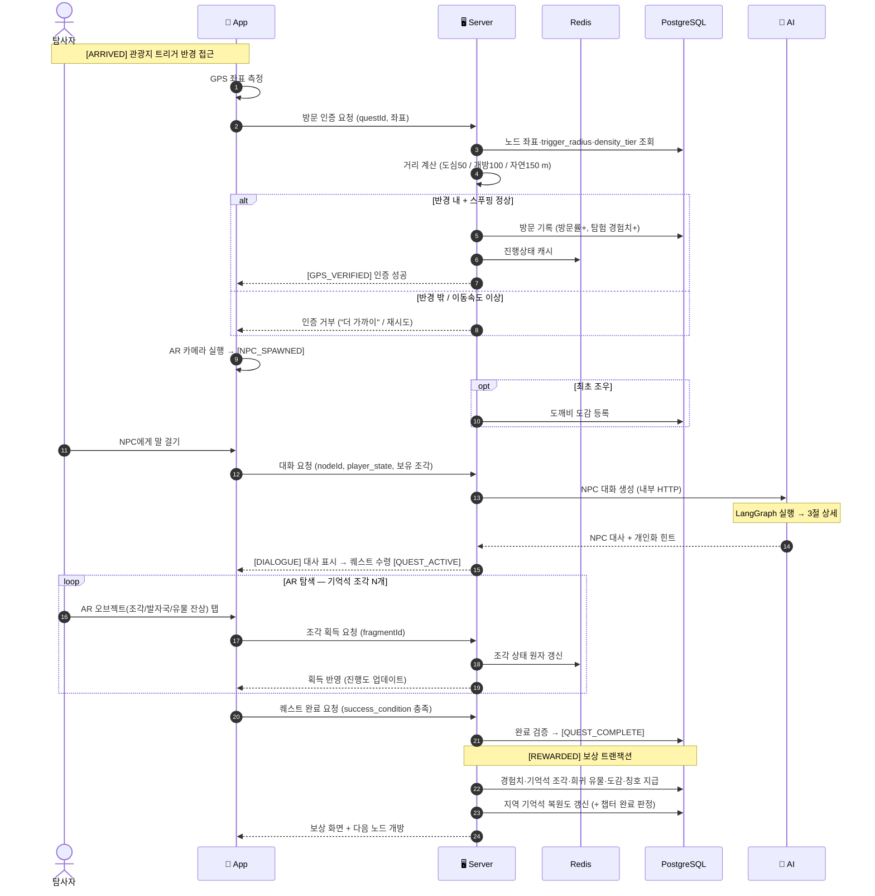

> 보상 지급은 **Postgres 트랜잭션**(정확성), 실시간 진행 상태는 **Redis**(속도). [기획_통합](./기획_통합.md) 3·9절.

---

## 3. 런타임 B — NPC 대화 (LangGraph 내부)

> `dokkaebi-ai`의 오케스트레이션 = **LangGraph `StateGraph`**. 각 노드가 우리 함수를 호출, 조건 엣지로 분기. (LangChain 풀세트 ❌)
>
> **grounding 기본 = 지역 인메모리(1-2)에 올린 그 장소 텍스트를 프롬프트에 직접 주입.** 벡터 검색(RAG)은 **옵션**(텍스트가 너무 크거나 교차 장소 검색일 때만, 그것도 인메모리 brute-force).

### 3-1. 그래프 (노드 · 조건 엣지)

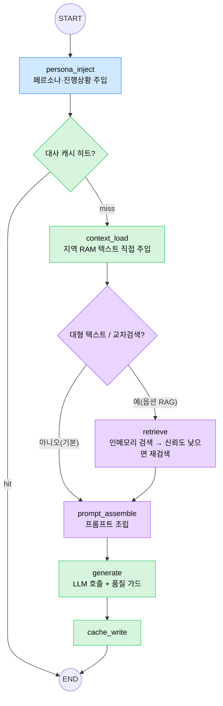

🟦 김예슬(그래프·페르소나 주입 시점) · 🟪 박준형(옵션 RAG 검색·재작성·프롬프트·품질) · 🟩 정찬희(캐시·context_load·LLM 클라이언트·배선) · 🟧 이지선(persona 시드·지역 텍스트/지식베이스 — 노드가 참조하는 데이터)

### 3-2. 상태(State) 스키마

```python
class DialogueState(TypedDict):
    node_id: str            # 장소 노드
    stage: str              # 등장 | 의뢰 | 힌트 | 완료
    player_state: dict      # 진행도, 보유 기억석 조각, 이전 대화 요약(멀티턴)
    persona: dict           # 아키타입·모티프·말투 (이지선 시드)
    context: str            # 그 장소 텍스트 (기본: 지역 RAM에서 직접 주입)
    retrieved: list[str]    # (옵션 RAG 시) 인메모리 검색 청크
    confidence: float       # (옵션 RAG 시) 재검색 분기 기준
    prompt: str
    response: str           # NPC 대사 / 힌트
    cache_key: str
```

### 3-3. 호출 시퀀스

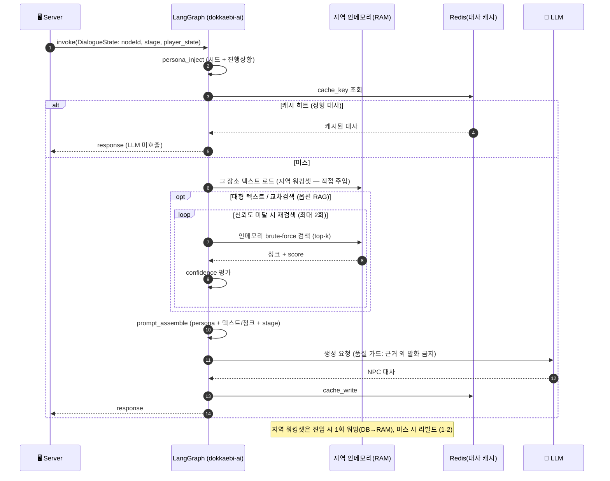

> **분기 이점**: 기본은 **지역 RAM 텍스트 직접 주입**(디스크·네트워크 0) / 대사 캐시 히트 → LLM 비용·지연 절감 / 옵션 RAG 시 신뢰도 낮으면 재검색 → 환각 감소 / 멀티턴은 `player_state.이전 대화 요약`으로 상태 유지.

### 3-4. 분기 대화 & 종료 (찐 RPG) — 기획 8-D 연동

> "이야기는 동적, 목표·종료는 정적." 그래프가 **대사 + 선택지(2~3개)**를 반환하고, 선택마다 재호출(멀티턴). **무한 분기는 노드별 상태머신 + 구조적 종료조건으로 가둔다.**

- **출력 확장**: `/v1/dialogue/turn`이 `response` + `choices[]` + `done` 반환 → 앱이 버튼으로. 선택 → `history`에 누적해 재호출(멀티턴), `inventory`로 연계(7-C).
- **상태머신**: 대화는 `등장 → 탐문(분기) → 힌트(퀘스트 수령)`까지(`done`). **조각 수집은 별도 AR 단계**(기획 3: `DIALOGUE → QUEST_ACTIVE → REWARDED`) — 채팅으로 안 끝냄. LLM은 대화 대사·선택지만, **단계·깊이상한**(3~4턴)은 시스템 통제.
- **종료**: 엔딩 = **N조각 수집 → 복원**(대화 소진 아님). 분기는 "AR 탐색으로" 수렴(branch & bottleneck). (옵션) 누적 선택 → 고정 2~3개 엔딩.
- 상세·구현단계: [기획 8-D](./기획_통합.md). 담당: 상태머신·종료=김예슬 / 선택지 프롬프트=박준형 / 대화 UI=정찬희.

### 3-5. 콘텐츠 생성 시점 & 상태/메모리 모델

> **시나리오를 LLM이 한 번에 다 짜지 않는다.** *구조는 규칙으로 미리, 고정 콘텐츠는 생성 시 1회, 분기 대화만 플레이 중 온디맨드.* LLM은 stateless → "메모리"는 별도 프레임워크 없이 **상태를 매 호출 주입**.

**무엇을 언제 만드나 (3분할)**
| 분류 | 무엇 | 시점 | LLM? | 저장 |
|---|---|---|---|---|
| **구조** | 노드 선택·순서·동선 | 생성 1회 | ❌ 규칙(거리·비인기) | `scenarios`/`scenario_nodes` |
| **고정 콘텐츠** | intro 대사·퀴즈·지령·힌트·페르소나 | 생성 1회(+캐시) | ✅ (검수) | 노드/시나리오에 저장 |
| **분기 대화** | 선택지·후속 대사 | **플레이 중 선택마다** | ✅ 온디맨드 | 캐시(대사), 경로는 비저장 |

- **왜 분리**: 분기는 경우의 수가 무한 → 다 미리 못 짬(8-D). 퀴즈·지령은 노드당 **고정**이라 생성 시 1번 만들고 저장(재방문·멀티 **일관성**, 비용↓).
- **연계 게이팅(7-C)**: `requires`(전제 단서) 충족 검사는 **코드가 노드 진입 시** 판정(LLM 아님). 미충족이면 "이전 노드 가서 얻어와" 안내(데드락 ❌).

**상태/메모리 (LLM 메모리 프레임워크 불필요)**
```
/v1/dialogue/turn 호출마다 함께 전송 → 프롬프트에 주입:
  history   : 이 노드 안 대화·선택       (멀티턴 — 짧음)
  inventory : 앞 노드들에서 모은 단서·조각 (연계 7-C — 시나리오 범위)
```
| 상태 | 저장 위치 | 범위 |
|---|---|---|
| 대화 history | 앱(플레이 중) → 요청에 실음 | 노드 1개 |
| inventory(연계) | 앱 `ScenarioStore` → (서버) `scenario_runs`/Redis | 시나리오 |
| 진행(완료 노드) | `ScenarioStore`(유저별 영속) / `scenario_runs` | 영구 |

- **길어지면**: history 통째 대신 **요약**(`player_state.이전 대화 요약`)으로 토큰 절약 — 유일한 메모리 최적화. 벡터/장기기억 MVP 불필요.
- 현재 구현: 구조+intro+분기대화. **퀴즈·지령·연계 게이팅은 생성 시 콘텐츠로 추가 예정**(프롬프트 [프롬프트_설계_v0](./프롬프트_설계_v0.md)).

---

## 4. 런타임 C — 멀티유저 협력 동기화

> 4인 파티가 기억석 조각을 분담 수집 → 실시간 공유 → 합동 복원. **동시성 핵심 = Redis 원자 처리(중복 획득 방지) + Socket.io 브로드캐스트.**

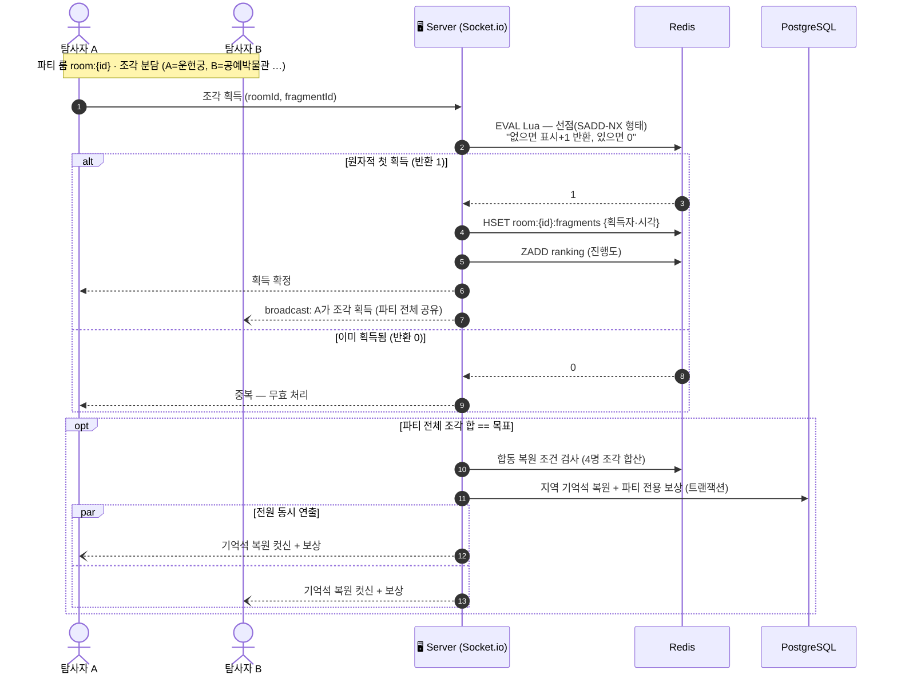

> **왜 Lua/원자처리**: 마지막 조각을 A·B가 동시에 탭하면 둘 다 "아직 안 주워짐" 보고 중복 획득(lost update). Lua 스크립트로 *check-and-set을 서버사이드 원자 실행* → 딱 한 명만 성공. 랭킹은 **Sorted Set(ZSET)**. (상세 근거: [개발계획.md](./개발계획.md) 리스크, 동시성 논의)

---

## 5. 맞춤 시나리오 생성 파이프라인

> 위시리스트 기반. **노드를 고르고 배열 + 연결 대사만 생성**(백지 ❌). 분산 목표는 규칙 11-3으로 강제.
>
> ⚠️ 아래 시퀀스는 **재사용 캐스케이드(5-1)에서 안 걸린 "신규 생성" 경로**다. 요청이 오면 먼저 5-1로 재사용을 시도하고, 끝까지 없을 때만 이 경로를 탄다.

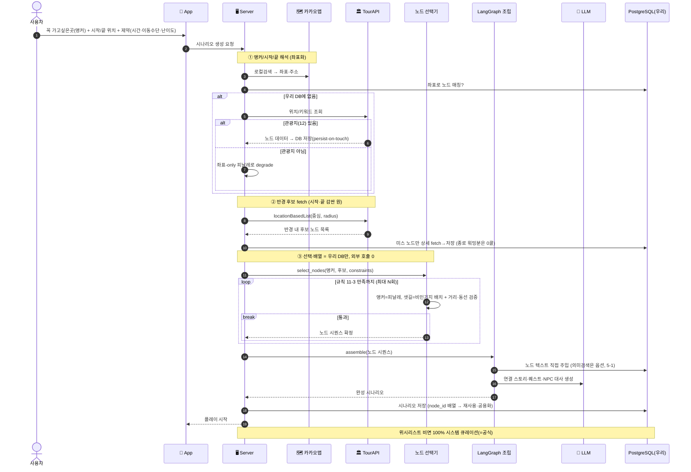

### 5-1. 재사용 우선 캐스케이드 — 공용 풀 → 노드 풀 → 대사 캐시

> 생성 요청마다 LLM을 새로 태우지 않는다. 위에서부터 재사용을 시도하고 **끝까지 없는 부분만 생성**. 공용 풀이 커질수록 ①에서 더 많이 걸려 **갈수록 싸진다**. (기획 [11-9](./기획_통합.md))

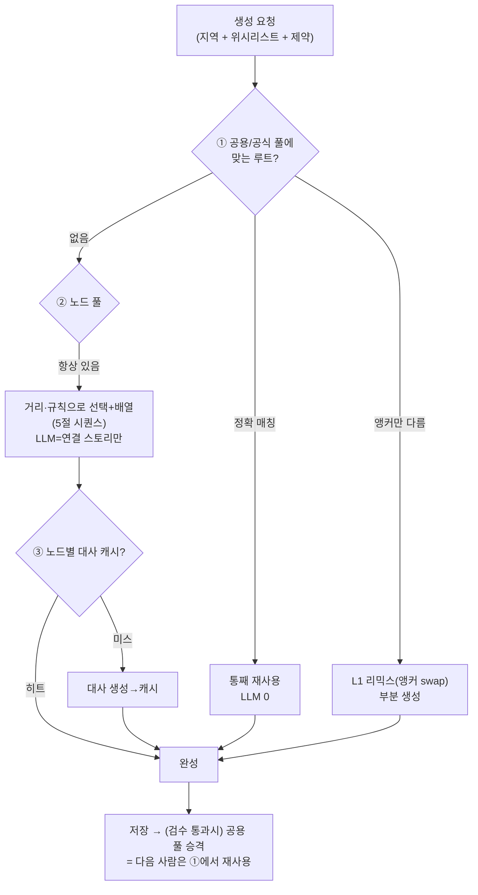

- **장소(노드)는 새로 안 만든다** — 노드 빌더가 적재해둔 걸 재사용. 새 사람이 와도 "그 위에 위시리스트 기반 1~2 노드만 얹기".
- 대사 캐시 = NPC 대화 그래프의 `cache_read`/`cache_write`(3-1)와 동일 메커니즘, 더 거친 단위.

### 5-2. 매칭 키 & 재사용/리믹스 분기

- **매칭 키 = 앵커(노드 ID 집합) + 제약칩(시간·이동수단·난이도)**
- **정확 매칭** → 통째 재사용 / **유사 매칭** → **자카드 유사도**(노드 ID 집합 겹침 비율)로 판정, 겹침 ≥ 임계(예: 70%)면 리믹스, 미만이면 신규
- ⚠️ 집합 연산이라 **임베딩 불필요** — "비슷한 시나리오 찾기"도 set 유사도로 충분(1-1 원칙 일관).

### 5-3. 거리·동선 계산 (5절의 "도보 동선 현실성" 구현)

> 노드 **후보 필터링(앵커 반경 내)** + **배열 순서(도보 동선)** 둘 다 거리 계산. 작은 경로문제이지 임베딩 아님 — **좌표 수학**.

| 방식 | 정확도 | 비용 | 적용 |
|---|---|---|---|
| **직선거리(haversine)+반경** | 대략 | 무료·즉시·키 0 | **M1~M2 MVP** (종로처럼 좁은 지역엔 충분) |
| **실제 도보경로**(카카오/구글 Directions) | 정확 | API 호출비·키 | M3+ / 발전방향 |

- 거리·선택·배열 = **AI 백엔드 노드 선택기**(박준형 규칙 알고리즘), 서버가 프록시. 시간예산(2h)→노드 개수 매핑 수치는 **박준형 EDA(지역 밀도)로 실측 확정**.

### 5-4. 3층 데이터 모델 — 장소 / 시나리오 / 세션 분리

> **"장소(노드)"와 "시나리오(루트)"와 "플레이 세션"은 다른 저장소.** 시나리오는 노드 본문을 복사하지 않고 **node_id 배열로 참조**(정규화) — 안 그러면 사용자×생성마다 데이터 폭발.

| 층 | 엔티티 | 단위 | 저장소 | 담당 |
|---|---|---|---|---|
| 장소 | `nodes` | 영구·공유, **1번만** 적재(모든 시나리오가 재사용) | PostgreSQL(+옵션 임베딩) | 이지선(빌더) |
| 시나리오 | `scenarios` | 생성/리믹스마다, **node_id 배열 참조** + 연결 스토리 | PostgreSQL | 김예슬·박준형 |
| 공용 | (scenarios + 게이트/평점) | 승격분 + 완주율·평점 | PostgreSQL | 김예슬 |
| 플레이 세션 | `scenario_runs`·`party_rooms` | 실시간 진행·4인 조각(누가 먼저=원자 선점) | **Redis**(핫) + DB(완주기록) | 김예슬 |

- **공유 퀘스트** = 시나리오 템플릿을 공용 풀에 올려 남이 같은 루트를 각자(비동기) 플레이.
- **멀티유저** = 같은 세션에 4인 동접, 조각 분담 수집 → **Redis 원자 선점**으로 중복방지(4절·party.gateway). 시나리오는 공유하되 **진행상태 저장소가 달라 안 섞는다**.

### 5-5. API·캐시·호출 타이밍 (적재 / 호출 / persist-on-touch)

> 시나리오 흐름에서 **무엇이 언제 적재되고 언제 외부를 호출하는지.** 핵심 원칙: 종로는 워밍돼 있어 **런타임 TourAPI ≈ 0**(카카오·LLM만), 롱테일·신규 앵커만 온디맨드+저장.

| 타이밍 | 언제 | 무엇 | 외부 |
|---|---|---|---|
| **적재(배치)** | 운영 전 1회 | 종로 워밍 = 노드 기본·집중률·텍스트 (1-3) | TourAPI(배치) |
| **호출(런타임)** | 세션 중 | 앵커·시작·끝 좌표화 / 반경 후보 / 상세 / 생성 | **카카오** · **locationBasedList** · TourAPI 상세(**DB 미스분만**) · **LLM** |
| **캐시 적재(persist-on-touch)** | 호출 직후 | 받은 노드·생성 시나리오·대사를 **우리 DB 저장** → 다음 0콜 | — |

```
[빌드타임] 종로 워밍 → 우리 DB
[런타임]
 1 앵커/시작/끝 입력 → 카카오 좌표 [호출] → DB 매칭(없으면 TourAPI fetch+저장 [호출+적재] / 비관광지면 좌표-only degrade)
 2 스타트 → 반경(시작·끝 감싼 원) → locationBasedList(radius) [호출] → 미스 노드만 상세+저장 [호출+적재] (종로는 0콜)
 3 선택(비인기 규칙)+배열(거리) → 우리 DB/메모리만 [호출 0]
 4 LLM 스토리·대사(grounding=DB 텍스트) [호출] → 대사 캐시 [적재]
 5 시나리오 저장(node_id 배열) [적재] → 재사용·공용(11-9)
```

> 결합: 거리 반경은 `locationBasedList`의 radius 파라미터로 후보를 받고, 동선·선택은 우리 DB에서 처리. **캐시가 곧 점진 적재**(1-1 ③ persist-on-touch).

### 5-6. 시나리오 생성 입력 contract (사용자 입력 → 앱→서버→AI)

> 좌표는 **앱(GPS·카카오)이 해석해 넘김** — AI는 좌표를 받을 뿐 카카오 호출 안 함. 위시리스트는 **자동완성(`searchKeyword2`)에서 확정한 `content_id`**로 받음(이름 문자열 ❌, 모호함 방지). `app/scenario/request.py::ScenarioRequest` 와 1:1.

```
ScenarioRequest {
  user_id,                          // 필수 — 시나리오 귀속
  start: {lat, lng},                // 필수 — 현재위치(GPS)
  end:   {lat, lng} | null,         // 선택 — 집(없으면 왕복). 끝점 가까운 노드=피날레
  radius_m | null,                  // 선택 — 없으면 transport로 자동
  transport: "walk" | "car",        // 반경 결정 (walk=2km / car=8km, config)
  wishlist: [{content_id, lat, lng, kind}],  // 선택·여러 개 — 앵커 (식당=나중)
  budget | null,                    // 선택 — MVP는 표시만(생성 미반영)
  // 나중(자리만): visit_date · companions(혼자/친구) · difficulty
}
```

**입력 규칙(결정)**
- **필수 = user_id·start만**, 나머지 선택. 위시리스트 비면 100% 시스템 큐레이션(11-6).
- **앵커 검색 = `searchKeyword2`** → 부분일치라 후보 여러 개 → **앱 자동완성에서 사용자가 탭**(정확 title 우선 정렬). ⚠️ 지역코드(areaCode/sigunguCode) 필터는 분류 불일치로 정답 누락 → 미사용.
- **위치 좌표화 = 카카오/GPS**(앱). 현재위치=GPS, 집·검색지정=카카오 로컬검색.

**검증·폴백(서버 책임)** — GPS 권한 거부→지도 수동지정 / 위시 반경 밖→경고·반경확장 / 끝점 과원거리→경고 / 빈 입력→큐레이션 / 검색 0건→안내.

---

## 6. 공용화 데이터 흐름 (개인 → 모두)


> 자동검수 = 통과/탈락 게이트, 평점·완주율 = 통과분의 노출 순위. (상세: [기획_통합](./기획_통합.md) 11-8)

---

## 7. AI · TourAPI 활용 지점 요약

| 단계 | TourAPI 쓰임 | 외부/AI 쓰임 | 저장 vs 생성 |
|---|---|---|---|
| 노드 워밍(빌드타임) | 기초지자체 관광지·집중률·오디오가이드 (종로) | 합성공식(규칙) + 텍스트 **DB 저장** | **미리 적재**(DB, 1-3) |
| 앵커/위치 해석 | (위치/키워드 조회, DB 미스 시) | **카카오** 로컬검색(좌표·주소) | 온디맨드+저장 |
| 후보 fetch | **locationBasedList(radius)** | — | 온디맨드+저장(미스분) |
| 시나리오 생성 | (노드에 반영됨) | 노드 **선택·배열**(규칙·거리) + 연결 대사(LLM) | 저장(재사용) |
| 시즌 퀘스트 | 행사·축제 기간 | 시즌 퀘스트 대사 | 자동 생성·만료 |
| 런타임 NPC 대화 | (지연 콜링 시 1콜) | 지역 RAM 텍스트 **직접 주입** → **대사·힌트 생성** (의미검색은 옵션) | 생성(+캐시) |
| 보상 밸런싱 | 집중률/방문도 | — | 규칙(가중치) |

---

## 8. 백엔드 구성 + AI 백엔드 내부 (담당자별)

### 8-1. 백엔드는 2개

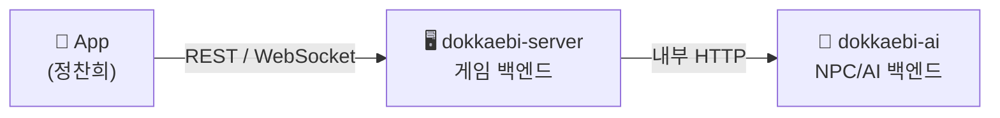

- **앱은 게임 서버하고만 통신.** NPC 대사 필요 시 게임 서버가 AI 서버를 *내부에서* 호출 → AI 키·비용 외부 비노출.
- 더 쪼개지 않음(2개면 충분). NPC 백엔드 = `dokkaebi-ai` 안의 **모듈**.

### 8-2. AI 백엔드 런타임 내부 — 모듈 & 담당자

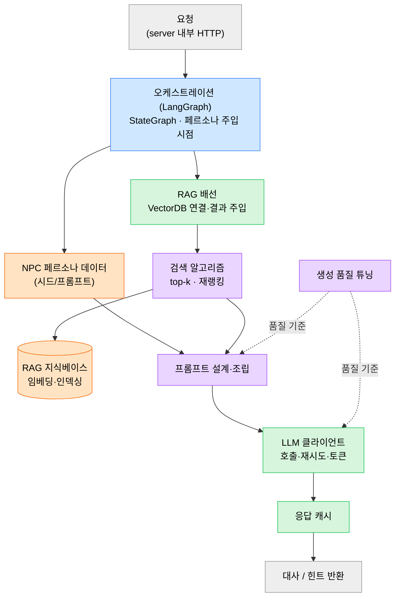

**담당자 색**: 🟦 김예슬(오케스트레이션·서빙) · 🟩 정찬희(서빙·RAG 배선·클라이언트·캐시) · 🟧 이지선(지식베이스·페르소나) · 🟪 박준형(검색 알고리즘·프롬프트·생성·eval)

> 경계: **박준형 = 무엇을 어떻게 잘 생성·검색하나** / **정찬희 = 그걸 호출·연결·운영** / **이지선 = AI가 먹을 재료** / **김예슬 = 지휘(LangGraph)**. 요청 큐/동시성 제한은 서빙(🟦🟩)에 포함.

### 8-3. 배치(오프라인) — 웹 프레임워크 불필요

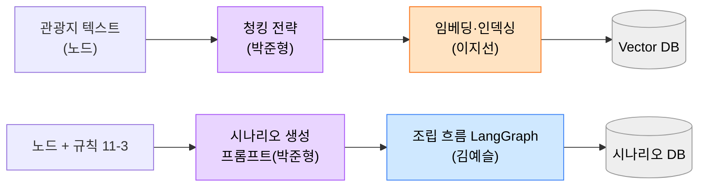

> 임베딩·시나리오 사전생성은 **느려도 되는 배치**라 실시간 큐와 분리. 담당은 8-2와 동일(품질=박준형 / 재료·인덱싱=이지선 / 흐름=김예슬). 역할 상세: [개발계획.md](./개발계획.md) 1장.

### 8-4. 큐 / 동시성 전략 — 세마포어 vs 작업 큐 vs 워커

> "큐"는 한 가지가 아니다. **동기 요청은 세마포어, 고처리량 배치는 워커 풀, 분산·내구성은 외부 큐.**

| 레이어 | 하는 일 | 언제 | 위치 |
|---|---|---|---|
| **세마포어 (암묵적 큐)** | 동시 호출 수 제한, 초과분은 대기 | **동기 요청**(런타임 NPC 대화) — 사용자가 응답 기다림 | `LLMClient` ✅구현 / `core/concurrency.py` |
| **인프로세스 작업 큐 + 워커 풀** | N개 워커가 큐를 병렬 소비 | **고처리량 배치**(임베딩·시나리오 사전생성·수집), 결과 즉시 안 기다림 | `core/queue.py`(`run_workers`/`process_batch`), `config.worker_count` ✅구현 |
| **외부 메시지 큐(Redis/SQS)** | 크로스 프로세스·내구성·재시도·우선순위 | 분산 워커·재시작 보존·유실 불가 | (확장) `WorkQueue` 구현체 1개 추가 |

**워커 형식 검토 (고처리량 작업)**
- 전국 임베딩·시나리오 대량 사전생성·TourAPI 수집은 **요청-응답이 아니라 워커 풀**로. `worker_count`로 워커 수 조절, LLM 호출은 여전히 `LLMClient` 세마포어로 제한(이중 안전).
- **배포**(9절): 워커 = **persistent 워커 컨테이너** 또는 **스케줄/이벤트 Lambda**(가벼운 증분). 전국 임베딩처럼 무거운 건 **AWS Batch / Fargate Task**.
- 결과를 모아야 하면 `bounded_gather`, side-effect 배치(적재·저장)는 `process_batch`.

**안 쓰는 경우**: 런타임 대화는 큐 ❌(세마포어로 충분) / MVP 배치는 스크립트로 충분 → 외부 큐는 규모·내구성 필요할 때.

> ⚠️ 세마포어·인프로세스 큐는 **프로세스별**. 멀티 인스턴스 + 계정 rate limit이면 **Redis 분산 rate limiter**나 외부 큐 필요(4·9절과 동일 맥락).

---

## 9. 배포 모델 (Deployment) — 핫패스=컨테이너 / 배치=서버리스

> **원칙: 상태 있는 핫패스(실시간·인메모리·LLM 오케스트레이션)는 persistent 컨테이너, 상태 없고 비주기/스파이크성은 서버리스.**
> "게임=Lambda"가 아니라 "게임의 *비실시간 조각*=Lambda". 실시간 게임의 권위 서버(존 서버)는 늘 persistent (AWS도 GameLift를 따로 두는 이유).

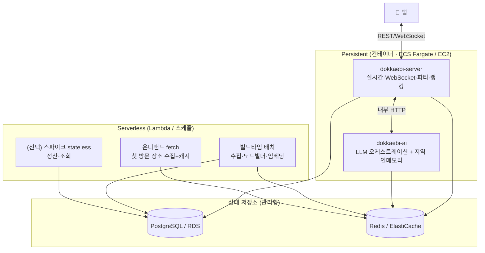

### 9-1. 컴포넌트별 배포 형태
| 컴포넌트 | 형태 | 이유 |
|---|---|---|
| `dokkaebi-server`(실시간) | **컨테이너** | WebSocket 지속 연결·파티 룸 상태 |
| `dokkaebi-ai`(핫패스) | **컨테이너** | 지역 인메모리 워밍(1-2)·LLM 대기 비용·콜드스타트 회피 |
| 데이터 배치(수집·노드빌더·임베딩) | **Lambda/스케줄** (무거우면 AWS Batch·Fargate Task) | 이벤트·주기성, 상태 없음 |
| 온디맨드 fetch(첫 방문) | **Lambda** | 스파이크, 상태 없음 |
| 정산·조회 등 stateless | **Lambda(선택)** | 스파이크, 트래픽 가변 |

### 9-2. 왜 핫패스는 Lambda 아님
- **지역 인메모리**(1-2): Lambda는 stateless·휘발성 → 워밍한 RAM이 안 남음 → 존 서버 패턴 붕괴
- **WebSocket**: Lambda는 지속 연결 X → 룸 상태 전부 외부화 + 메시지당 과금 → 느리고 복잡
- **LLM 1~3초**: 대기 시간 통째 과금 + 콜드스타트 지연 → 인터랙티브 NPC에 불리

### 9-3. 단계별 가이드
- **로컬**: `docker-compose`(server + ai + pg + redis) — M0와 동일
- **MVP 배포**: 핫패스 컨테이너 2개(Fargate 또는 EC2 1대) + **배치만 스케줄 Lambda**. 풀 서버리스 ❌
- **확장**: 지역 샤딩 시 server/ai 인스턴스 증설 + 같은 지역 유저 라우팅(1-2·8-2)
- ⚠️ 전국 임베딩처럼 **무거운 배치는 Lambda 15분·메모리 한계** → AWS Batch / Fargate Task. 가벼운 증분 sync만 Lambda.

> 인프라 설정(compose·배포 매니페스트·CI)은 `dokkaebi-infra`에서 관리.
