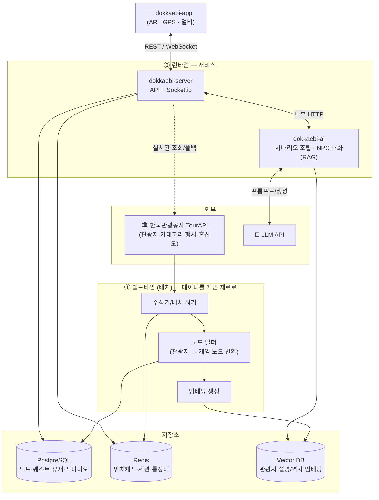
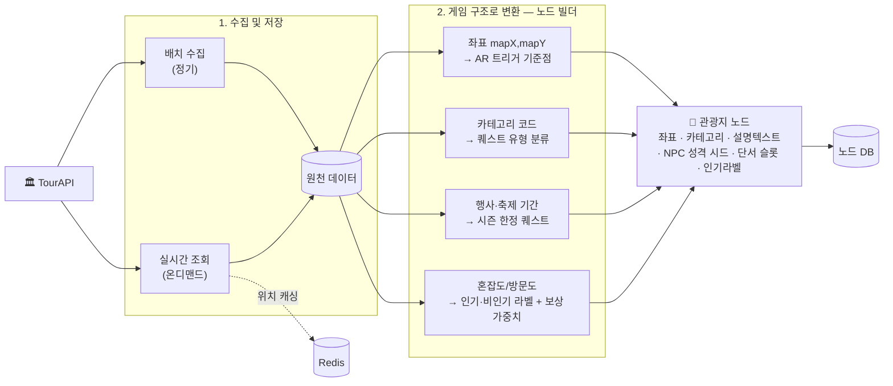
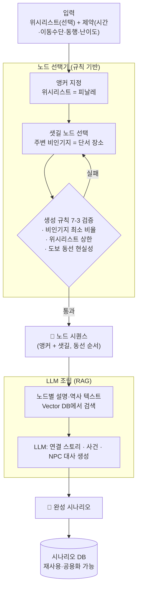
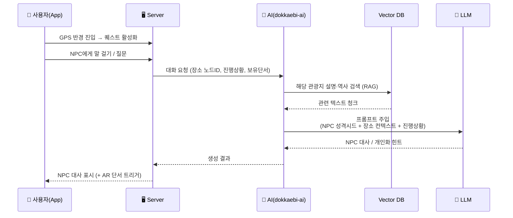
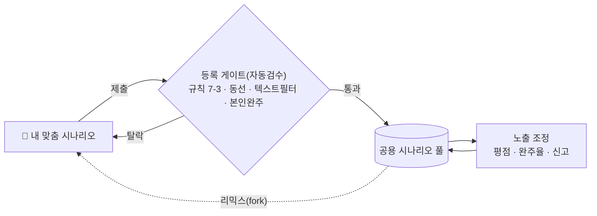
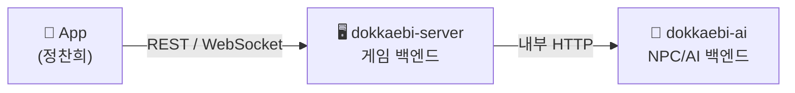
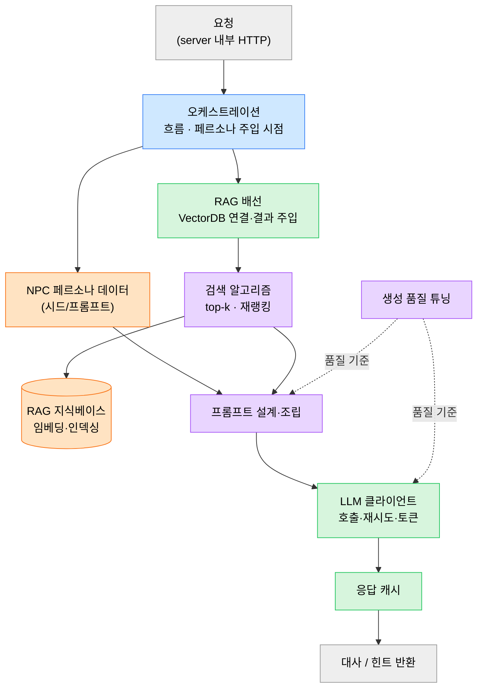
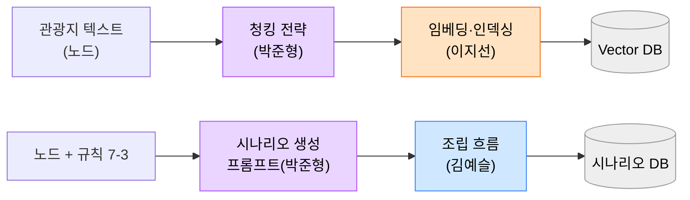

# 도깨비: 팔도의 비밀 — 아키텍처 & 데이터 파이프라인

> 핵심 관점 두 가지
> 1. **TourAPI(OpenAPI) 데이터를 어떻게 "게임 재료"로 변환하는가** — 조회용 데이터 → 노드/단서/시즌퀘스트
> 2. **AI를 어느 단계에서 쓰는가** — 백지 창작이 아니라 ① 시나리오 조립 ② 런타임 NPC 대화(RAG)

---

## 0. 큰 그림 한 장

> **빌드타임(파란 단계)**에서 무거운 변환·임베딩을 미리 끝내두고, **런타임**에서는 가볍게 조립·대화만 한다. 이것이 "얼마나 저장하고 얼마나 AI를 쓰나"의 분리선이다.

---

## 1. 파이프라인 ①: TourAPI → 게임 재료 (제안서 3-step)

> 제안서의 "수집·저장 → 게임 구조 변환 → AI 콘텐츠 생성" 3단계를 데이터 흐름으로.

**포인트**
- 배치 수집과 실시간 조회 **병행**. 위치 데이터는 Redis 캐싱 → **TourAPI 장애 시 캐시로 서비스 유지(폴백)**
- 변환 결과물 = **관광지 노드**. 이후 모든 시나리오·NPC 대사의 재료가 됨
- 혼잡도 → 비인기지에 **희귀 보상 가중치** 부여 (관광 분산 목표의 데이터 근거)

---

## 2. 파이프라인 ②: AI 시나리오 생성 (노드 "조립")

> 위시리스트 기반 맞춤 시나리오. AI는 **노드를 고르고 배열하고 사이 대사만 생성**한다(백지 창작 ❌).

**포인트**
- **노드 선택 단계에서 분산 목표를 강제** (규칙 위반 시 재선택) → AI 자유도와 정책 목표를 분리
- LLM은 검증된 노드 텍스트만 컨텍스트로 받으므로 **역사 왜곡 위험 ↓**
- 생성 결과를 저장 = 그대로 **재사용/공용 시나리오**. 위시리스트가 비면 100% 시스템 큐레이션(=공식)

---

## 3. 파이프라인 ③: 런타임 NPC 대화 (RAG)

> 플레이 중 사용자가 그 장소의 NPC와 실시간 대화. 장소 맥락 + 진행 상황을 프롬프트에 주입.

**포인트**
- **NPC 성격 시드**(노드에 저장) + **RAG로 가져온 실제 장소 정보** + **사용자 진행 상황** → 3개를 합쳐 프롬프트 구성
- 같은 장소라도 진행 상황·보유 단서에 따라 **개인화된 힌트**가 나옴
- 자주 쓰는 대사는 캐싱해 LLM 호출 비용·지연 절감

---

## 4. AI · TourAPI 활용 지점 요약

| 단계 | TourAPI 쓰임 | AI 쓰임 | 저장 vs 생성 |
|---|---|---|---|
| 노드 빌드 (빌드타임) | 좌표·카테고리·행사·혼잡도 | 설명/역사 **임베딩** | **저장** (DB·VectorDB) |
| 시나리오 생성 | (노드에 이미 반영됨) | 노드 **조립** + 연결 대사 생성 | 저장(재사용) |
| 시즌 퀘스트 | 행사·축제 기간 데이터 | 시즌 사건 대사 생성 | 자동 생성·만료 |
| 런타임 NPC 대화 | (RAG로 설명 텍스트) | **대사·힌트 실시간 생성** | 생성(+캐시) |
| 보상 밸런싱 | 혼잡도/방문도 | — | 규칙(가중치) |

> **요약**: 무겁고 정확성이 중요한 일(수집·변환·임베딩)은 **빌드타임에 저장**, 창의·맥락이 필요한 일(조립·대화)만 **런타임 AI**. TourAPI는 "노드의 재료", AI는 "노드를 이야기로 엮는 손".

---

## 5. 공용화 데이터 흐름 (개인 → 모두)

> 자동검수 = 통과/탈락 게이트, 평점·완주율 = 통과분의 노출 순위. (상세: 기획서 8-3)

---

## 6. 백엔드 구성 + AI 백엔드 내부 (담당자별)

### 6-1. 백엔드는 2개

- **앱은 게임 서버하고만 통신**한다. NPC 대사가 필요할 때 게임 서버가 AI 서버를 *내부에서* 호출 → AI 서버·키·비용은 외부 비노출.
- 더 쪼개지 않는다(2개면 충분). NPC 백엔드 = `dokkaebi-ai` 한 서버 안의 **모듈들**.

### 6-2. AI 백엔드(`dokkaebi-ai`) 런타임 내부 — 모듈 & 담당자

**담당자 색**: 🟦 김예슬(오케스트레이션·서빙) · 🟩 정찬희(서빙·RAG 배선·클라이언트·캐시) · 🟧 이지선(지식베이스·페르소나) · 🟪 박준형(검색 알고리즘·프롬프트·생성·eval)

> 경계: **박준형 = 무엇을 어떻게 잘 생성·검색하나**(보라) / **정찬희 = 그걸 호출·연결·운영**(초록) / **이지선 = AI가 먹을 재료**(주황) / **김예슬 = 지휘**(파랑). 요청 큐/동시성 제한은 서빙(🟦🟩)에 포함.

### 6-3. 배치(오프라인) — 웹 프레임워크 불필요

> 임베딩·시나리오 사전생성은 **느려도 되는 배치**라 실시간 큐와 분리. 담당 분담은 6-2와 동일(품질=박준형 / 재료·인덱싱=이지선 / 흐름=김예슬). (역할 상세: 개발계획.md 1장)
