# 도깨비: 팔도의 비밀 — 아키텍처 & 데이터 파이프라인

> 기능 정본 = [기획_통합.md](./기획_통합.md). 용어(기억석 조각·탐사자·탐험·수집)·섹션 번호는 통합본 기준. 역할 분담은 [개발계획.md](./개발계획.md).
>
> 핵심 관점 두 가지
> 1. **TourAPI(OpenAPI) 데이터를 어떻게 "게임 재료"로 변환하는가** — 조회용 데이터 → 노드/기억석 조각/시즌퀘스트
> 2. **AI를 어느 단계에서 쓰는가** — 백지 창작 ❌ → ① 시나리오 조립 ② 런타임 NPC 대화(RAG·LangGraph)

**문서 구성**: 0 컨텍스트 → 1 빌드타임 → 2~4 런타임(솔로·NPC·멀티) → 5 맞춤생성 → 6 공용화 → 7 요약 → 8 백엔드 내부(담당자) → 9 배포

---

## 0. 시스템 컨텍스트 (큰 그림)

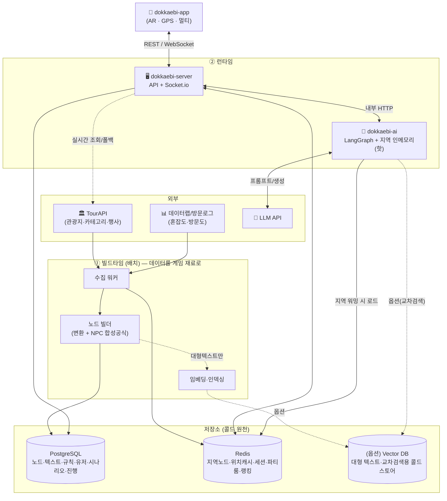

> **분리선**: 무겁고 정확성이 중요한 일(수집·변환·규칙화)은 **빌드타임에 저장**, 창의·맥락이 필요한 일(조립·대화)만 **런타임 AI**. TourAPI는 "노드의 재료", AI는 "노드를 이야기로 엮는 손".
>
> **데이터 처리 2원칙** (1-1·1-2 상세): ① **퀘스트 로직 = 규칙**(임베딩 0) / **대화 = 그 장소 텍스트 직접 주입**(RAG·임베딩은 옵션). ② 런타임은 **지역을 RAM에 올려 서빙**(존 서버 패턴), Vector DB는 콜드/옵션으로 강등.

---

## 1. 빌드타임 파이프라인 — TourAPI → 게임 재료

> 제안서 3-step(수집·저장 → 게임 구조 변환 → AI 재료화)을 실제 흐름으로.

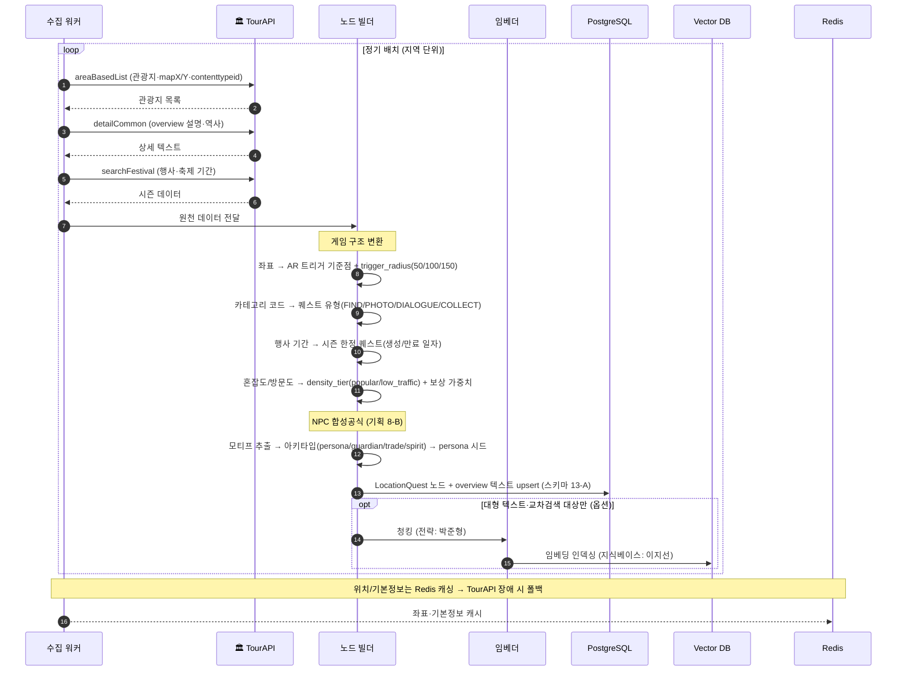

**포인트**
- 배치 수집 + 실시간 조회 병행, 위치는 Redis 캐싱(폴백)
- 결과물 = **관광지 노드**(이후 모든 시나리오·NPC 대사의 재료). **overview 텍스트는 DB에 그대로 저장**(런타임 직접 주입용) — 임베딩은 기본 아님
- 혼잡도는 TourAPI 코어에 없을 수 있음 → **데이터랩/자체 방문 로그**로 보완 (TODO: 데이터 소스 확정)

### 1-1. 데이터 처리 원칙 — 규칙 + 직접 주입 우선, 임베딩은 최소/옵션

> **핵심: 퀘스트 로직(규칙) ↔ 대화 grounding(텍스트)을 분리.** "전부 임베딩"하지 않는다. 그래서 임베딩 용량/수집 부담 자체가 거의 사라진다.

**① 퀘스트 로직 = 100% 규칙 (임베딩 0)**
- 퀘스트 유형(FIND/PHOTO/DIALOGUE/COLLECT) ← `contenttypeid` 규칙
- NPC 아키타입(persona/guardian/trade/spirit) ← 합성공식 규칙
- 보상 가중치·trigger_radius·시즌 ← 규칙
- → 전부 결정적, **노드 필드에 저장**. 벡터 불필요.

**② NPC 대화 grounding = "그 장소 텍스트 직접 주입"이 기본, RAG는 옵션**
- 한 NPC는 자기 장소 얘기만 함 → 그 장소 `overview`(수백~수천 자)를 **프롬프트에 통째로 주입**. 단일 장소 대화엔 **벡터 검색 불필요**.
- **RAG/임베딩은 예외**: 텍스트가 컨텍스트 한도 초과, 또는 "세종 관련 장소 찾기" 같은 **교차 장소 의미검색**일 때만. 그것도 지역 한정·지연 생성.

**③ 콜링 = 지연(lazy) 온디맨드 + 캐시**
```
장소 도착 → 노드 텍스트 가져옴(Redis/DB 캐시 → 없으면 TourAPI on-demand 1콜)
         → 프롬프트 직접 주입 → 대사 생성 → 결과/텍스트 캐시(다음 방문자 콜 0)
```
- 활성 지역(종로→확장): 사전 워밍 / 롱테일(전국 나머지): 첫 방문 때만 fetch+캐시 → **사전 벌크 임베딩·수집 불필요**

> 결과: ⓐ 전국 임베딩 GB 걱정 → 대부분 임베딩 안 함(옵션·지역한정 → 거의 0) / ⓑ 전국 벌크 수집 부담 → 방문된 곳만 받음. *진짜 신경 쓸 비용·지연은 런타임 LLM 호출* → 캐시·동시성으로 관리(3·4절).

### 1-2. 런타임 데이터 계층 — 지역 인메모리 (존 서버 패턴)

> 게임 서버이므로 **locality(국소성)** 를 쓴다. 한 세션의 워킹셋 = 지금 있는 지역 하나 → **그 지역만 RAM에 올려 서빙**. 디스크 벡터DB를 매번 때리지 않는다.

```
콜드(원천)   PostgreSQL(노드·텍스트·규칙)  [+ (옵션) Vector DB = 콜드 스토어]
   ↓ 지역 진입 시 워밍
웜(공유)     Redis (지역 노드·세션·파티 룸 상태) — 인메모리, 인스턴스 간 공유
   ↓ 핫셋 로드
핫(초고속)   AI 서버 프로세스 RAM — 활성 지역 텍스트 (+옵션: 소형 임베딩 numpy)
```

- **워밍**: 지역 진입(또는 부팅 시 파일럿 지역 pre-warm) → 그 지역 워킹셋을 RAM에. 이후 대화는 RAM에서 직접 주입/검색 → 디스크·네트워크 왕복 0.
- **용량**: 종로 ~20곳 ≈ 수십~수백 KB, 서울 ~2천곳 다 올려도 ≈ ~40MB → 인스턴스 하나에 여러 지역 상주 가능.
- **검색**: 지역 단위면 벡터 수십~수천 → 필요 시 **인메모리 brute-force 코사인(numpy)** 마이크로초. **디스크 ANN 인덱스 불필요**(ANN은 10⁵~10⁶ 벡터↑에서 의미).
- **챙길 것**: ⓐ 인프로세스 RAM은 휘발성·인스턴스별 → **읽기 캐시**(원천=DB, 미스 시 리빌드) ⓑ **LRU 제거**로 워킹셋 bound ⓒ 정적 텍스트라 무효화는 TTL/버전 bump ⓓ 실시간 멀티 동시성은 여전히 **Redis 원자처리**(4절).
- **트레이드오프**: 유저가 여러 지역에 흩어지면 인스턴스마다 다중 지역 적재 → **지역 기반 샤딩**(같은 지역 유저를 같은 인스턴스로, MMO 존 서버식)이 이상적. 초기엔 단일 인스턴스 + LRU로 충분.

> 한 줄: **"지역을 존처럼 RAM에 올려 서빙, 디스크 벡터DB는 콜드/옵션."**

---

## 2. 런타임 A — 솔로 게임플레이 전체 (도착 → 보상)

> 상태머신 `[ARRIVED]→[GPS_VERIFIED]→[NPC_SPAWNED]→[DIALOGUE]→[QUEST_ACTIVE]→[QUEST_COMPLETE]→[REWARDED]` 을 시퀀스로.

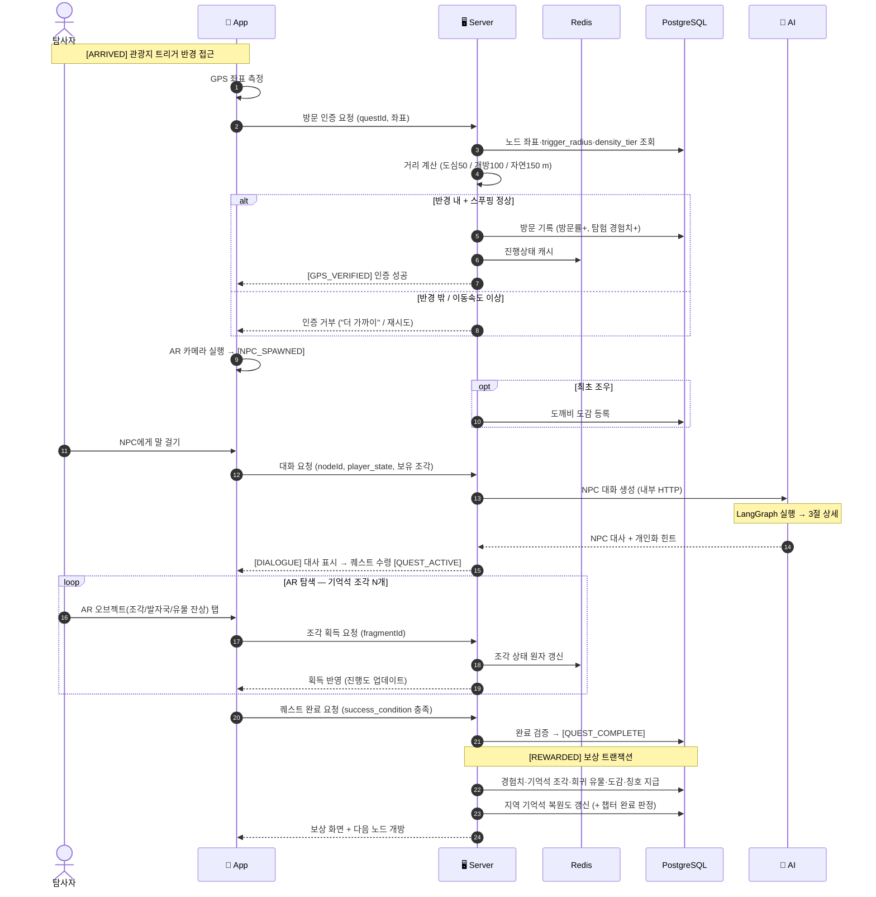

> 보상 지급은 **Postgres 트랜잭션**(정확성), 실시간 진행 상태는 **Redis**(속도). [기획_통합](./기획_통합.md) 3·9절.

---

## 3. 런타임 B — NPC 대화 (LangGraph 내부)

> `dokkaebi-ai`의 오케스트레이션 = **LangGraph `StateGraph`**. 각 노드가 우리 함수를 호출, 조건 엣지로 분기. (LangChain 풀세트 ❌)
>
> **grounding 기본 = 지역 인메모리(1-2)에 올린 그 장소 텍스트를 프롬프트에 직접 주입.** 벡터 검색(RAG)은 **옵션**(텍스트가 너무 크거나 교차 장소 검색일 때만, 그것도 인메모리 brute-force).

### 3-1. 그래프 (노드 · 조건 엣지)

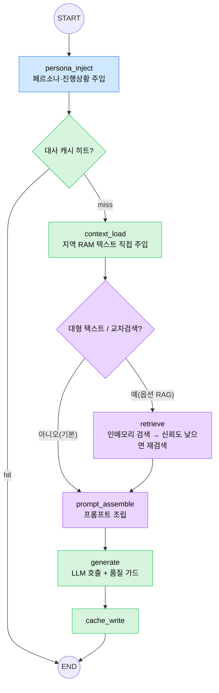

🟦 김예슬(그래프·페르소나 주입 시점) · 🟪 박준형(옵션 RAG 검색·재작성·프롬프트·품질) · 🟩 정찬희(캐시·context_load·LLM 클라이언트·배선) · 🟧 이지선(persona 시드·지역 텍스트/지식베이스 — 노드가 참조하는 데이터)

### 3-2. 상태(State) 스키마

```python
class DialogueState(TypedDict):
    node_id: str            # 장소 노드
    stage: str              # 등장 | 의뢰 | 힌트 | 완료
    player_state: dict      # 진행도, 보유 기억석 조각, 이전 대화 요약(멀티턴)
    persona: dict           # 아키타입·모티프·말투 (이지선 시드)
    context: str            # 그 장소 텍스트 (기본: 지역 RAM에서 직접 주입)
    retrieved: list[str]    # (옵션 RAG 시) 인메모리 검색 청크
    confidence: float       # (옵션 RAG 시) 재검색 분기 기준
    prompt: str
    response: str           # NPC 대사 / 힌트
    cache_key: str
```

### 3-3. 호출 시퀀스

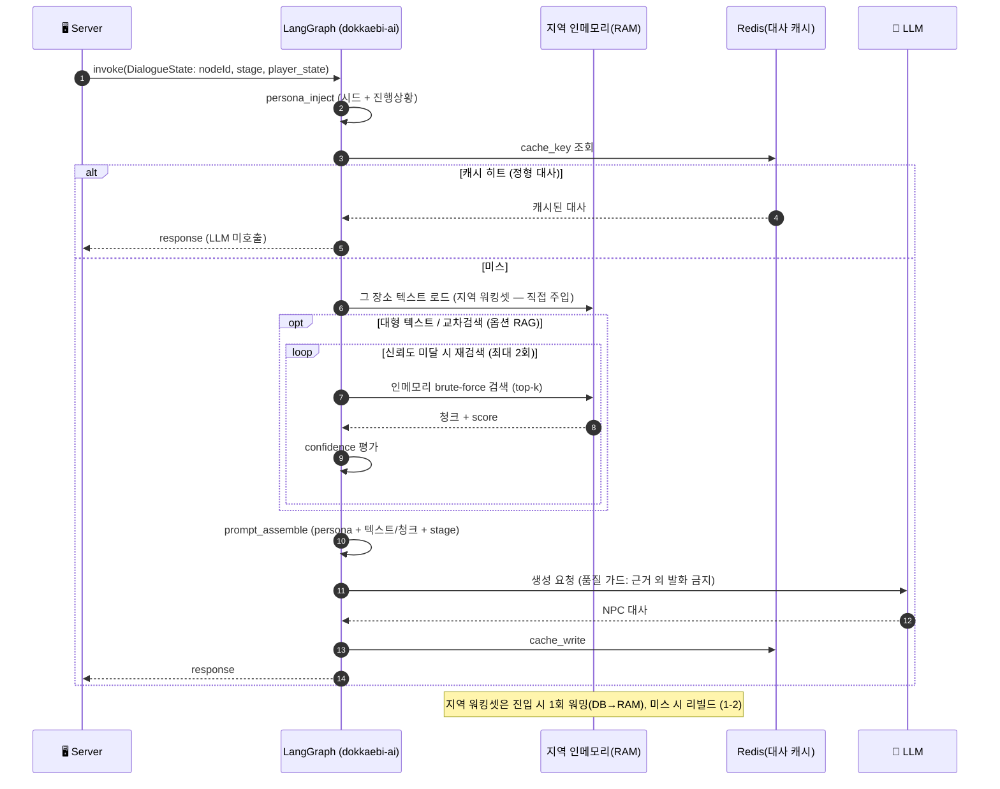

> **분기 이점**: 기본은 **지역 RAM 텍스트 직접 주입**(디스크·네트워크 0) / 대사 캐시 히트 → LLM 비용·지연 절감 / 옵션 RAG 시 신뢰도 낮으면 재검색 → 환각 감소 / 멀티턴은 `player_state.이전 대화 요약`으로 상태 유지.

---

## 4. 런타임 C — 멀티유저 협력 동기화

> 4인 파티가 기억석 조각을 분담 수집 → 실시간 공유 → 합동 복원. **동시성 핵심 = Redis 원자 처리(중복 획득 방지) + Socket.io 브로드캐스트.**

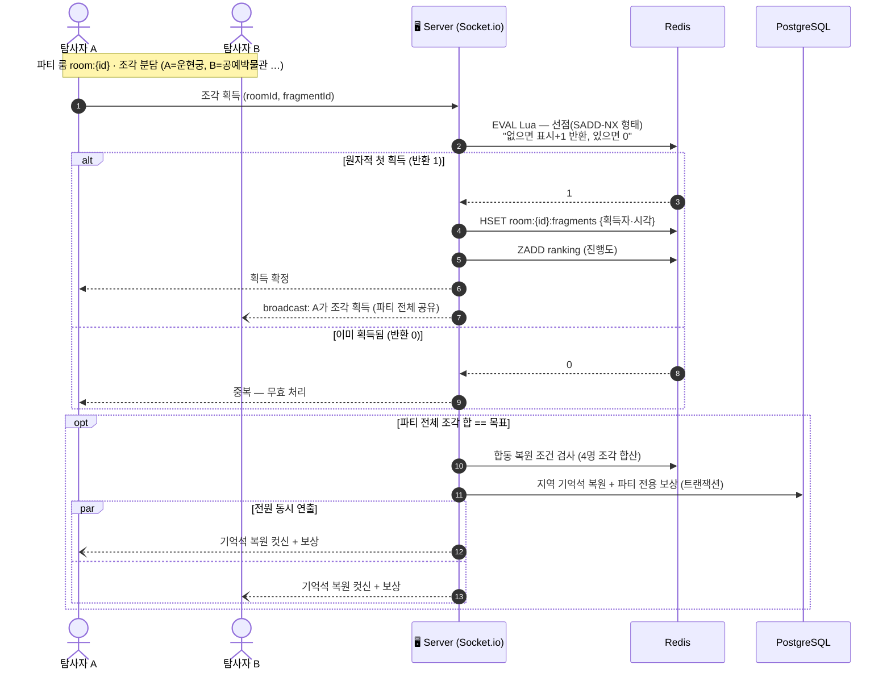

> **왜 Lua/원자처리**: 마지막 조각을 A·B가 동시에 탭하면 둘 다 "아직 안 주워짐" 보고 중복 획득(lost update). Lua 스크립트로 *check-and-set을 서버사이드 원자 실행* → 딱 한 명만 성공. 랭킹은 **Sorted Set(ZSET)**. (상세 근거: [개발계획.md](./개발계획.md) 리스크, 동시성 논의)

---

## 5. 맞춤 시나리오 생성 파이프라인

> 위시리스트 기반. **노드를 고르고 배열 + 연결 대사만 생성**(백지 ❌). 분산 목표는 규칙 11-3으로 강제.

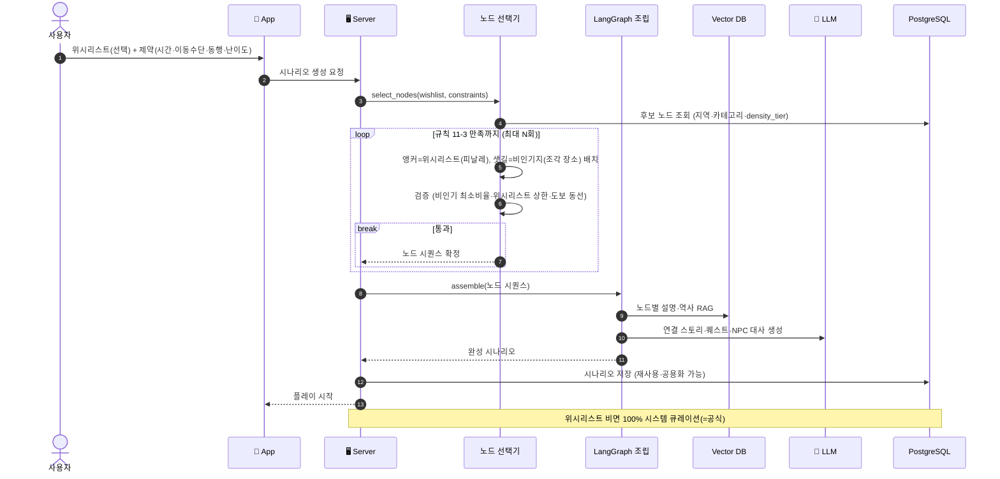

---

## 6. 공용화 데이터 흐름 (개인 → 모두)


> 자동검수 = 통과/탈락 게이트, 평점·완주율 = 통과분의 노출 순위. (상세: [기획_통합](./기획_통합.md) 11-8)

---

## 7. AI · TourAPI 활용 지점 요약

| 단계 | TourAPI 쓰임 | AI 쓰임 | 저장 vs 생성 |
|---|---|---|---|
| 노드 빌드(빌드타임) | 좌표·카테고리·행사·(혼잡도) | 합성공식(규칙) + 텍스트 **DB 저장** (임베딩은 옵션) | **저장**(DB / 옵션 VectorDB) |
| 시나리오 생성 | (노드에 반영됨) | 노드 **조립** + 연결 대사 | 저장(재사용) |
| 시즌 퀘스트 | 행사·축제 기간 | 시즌 퀘스트 대사 | 자동 생성·만료 |
| 런타임 NPC 대화 | (지연 콜링 시 1콜) | 지역 RAM 텍스트 **직접 주입** → **대사·힌트 생성** (RAG는 옵션) | 생성(+캐시) |
| 보상 밸런싱 | 혼잡도/방문도 | — | 규칙(가중치) |

---

## 8. 백엔드 구성 + AI 백엔드 내부 (담당자별)

### 8-1. 백엔드는 2개

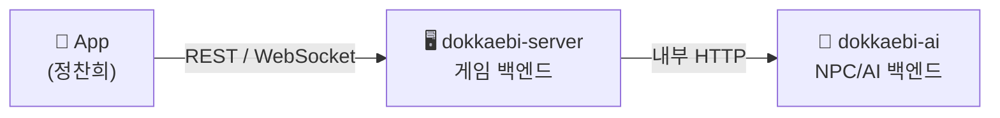

- **앱은 게임 서버하고만 통신.** NPC 대사 필요 시 게임 서버가 AI 서버를 *내부에서* 호출 → AI 키·비용 외부 비노출.
- 더 쪼개지 않음(2개면 충분). NPC 백엔드 = `dokkaebi-ai` 안의 **모듈**.

### 8-2. AI 백엔드 런타임 내부 — 모듈 & 담당자

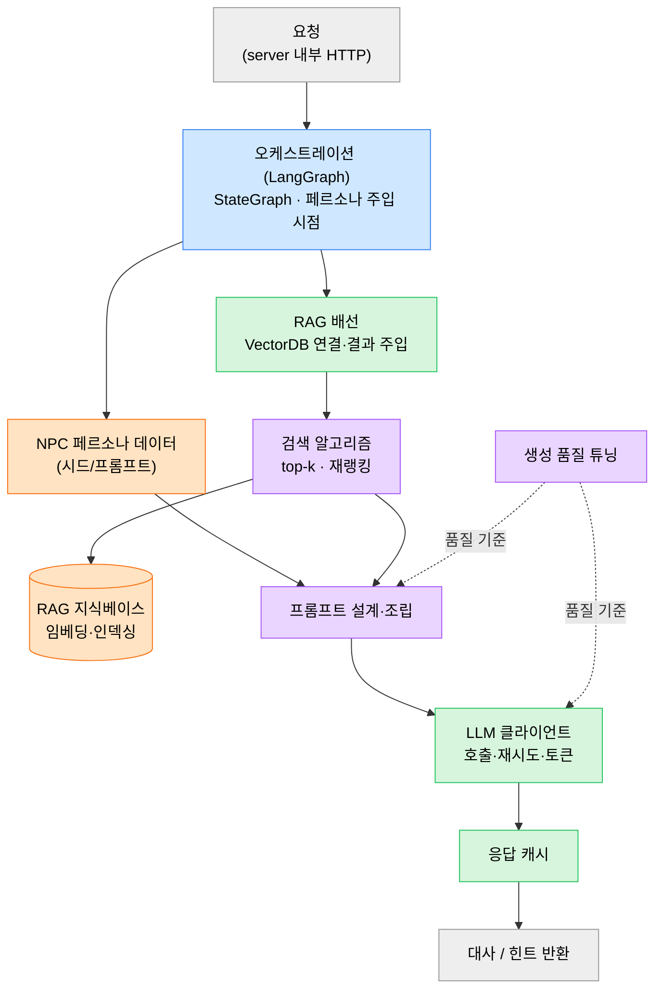

**담당자 색**: 🟦 김예슬(오케스트레이션·서빙) · 🟩 정찬희(서빙·RAG 배선·클라이언트·캐시) · 🟧 이지선(지식베이스·페르소나) · 🟪 박준형(검색 알고리즘·프롬프트·생성·eval)

> 경계: **박준형 = 무엇을 어떻게 잘 생성·검색하나** / **정찬희 = 그걸 호출·연결·운영** / **이지선 = AI가 먹을 재료** / **김예슬 = 지휘(LangGraph)**. 요청 큐/동시성 제한은 서빙(🟦🟩)에 포함.

### 8-3. 배치(오프라인) — 웹 프레임워크 불필요

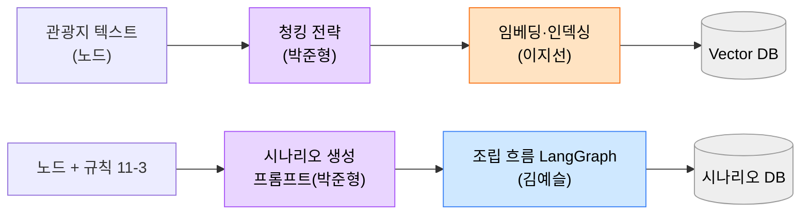

> 임베딩·시나리오 사전생성은 **느려도 되는 배치**라 실시간 큐와 분리. 담당은 8-2와 동일(품질=박준형 / 재료·인덱싱=이지선 / 흐름=김예슬). 역할 상세: [개발계획.md](./개발계획.md) 1장.

### 8-4. 큐 / 동시성 전략 — 세마포어 vs 작업 큐 vs 워커

> "큐"는 한 가지가 아니다. **동기 요청은 세마포어, 고처리량 배치는 워커 풀, 분산·내구성은 외부 큐.**

| 레이어 | 하는 일 | 언제 | 위치 |
|---|---|---|---|
| **세마포어 (암묵적 큐)** | 동시 호출 수 제한, 초과분은 대기 | **동기 요청**(런타임 NPC 대화) — 사용자가 응답 기다림 | `LLMClient` ✅구현 / `core/concurrency.py` |
| **인프로세스 작업 큐 + 워커 풀** | N개 워커가 큐를 병렬 소비 | **고처리량 배치**(임베딩·시나리오 사전생성·수집), 결과 즉시 안 기다림 | `core/queue.py`(`run_workers`/`process_batch`), `config.worker_count` ✅구현 |
| **외부 메시지 큐(Redis/SQS)** | 크로스 프로세스·내구성·재시도·우선순위 | 분산 워커·재시작 보존·유실 불가 | (확장) `WorkQueue` 구현체 1개 추가 |

**워커 형식 검토 (고처리량 작업)**
- 전국 임베딩·시나리오 대량 사전생성·TourAPI 수집은 **요청-응답이 아니라 워커 풀**로. `worker_count`로 워커 수 조절, LLM 호출은 여전히 `LLMClient` 세마포어로 제한(이중 안전).
- **배포**(9절): 워커 = **persistent 워커 컨테이너** 또는 **스케줄/이벤트 Lambda**(가벼운 증분). 전국 임베딩처럼 무거운 건 **AWS Batch / Fargate Task**.
- 결과를 모아야 하면 `bounded_gather`, side-effect 배치(적재·저장)는 `process_batch`.

**안 쓰는 경우**: 런타임 대화는 큐 ❌(세마포어로 충분) / MVP 배치는 스크립트로 충분 → 외부 큐는 규모·내구성 필요할 때.

> ⚠️ 세마포어·인프로세스 큐는 **프로세스별**. 멀티 인스턴스 + 계정 rate limit이면 **Redis 분산 rate limiter**나 외부 큐 필요(4·9절과 동일 맥락).

---

## 9. 배포 모델 (Deployment) — 핫패스=컨테이너 / 배치=서버리스

> **원칙: 상태 있는 핫패스(실시간·인메모리·LLM 오케스트레이션)는 persistent 컨테이너, 상태 없고 비주기/스파이크성은 서버리스.**
> "게임=Lambda"가 아니라 "게임의 *비실시간 조각*=Lambda". 실시간 게임의 권위 서버(존 서버)는 늘 persistent (AWS도 GameLift를 따로 두는 이유).

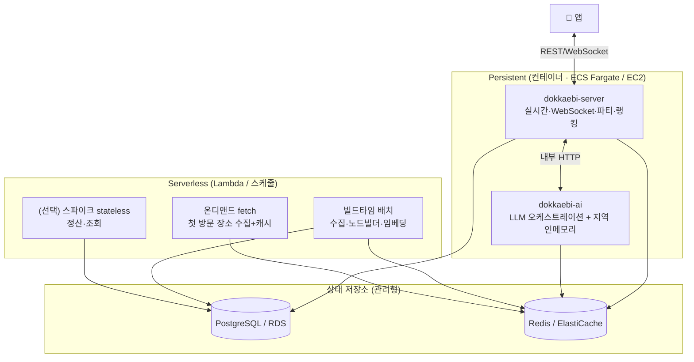

### 9-1. 컴포넌트별 배포 형태
| 컴포넌트 | 형태 | 이유 |
|---|---|---|
| `dokkaebi-server`(실시간) | **컨테이너** | WebSocket 지속 연결·파티 룸 상태 |
| `dokkaebi-ai`(핫패스) | **컨테이너** | 지역 인메모리 워밍(1-2)·LLM 대기 비용·콜드스타트 회피 |
| 데이터 배치(수집·노드빌더·임베딩) | **Lambda/스케줄** (무거우면 AWS Batch·Fargate Task) | 이벤트·주기성, 상태 없음 |
| 온디맨드 fetch(첫 방문) | **Lambda** | 스파이크, 상태 없음 |
| 정산·조회 등 stateless | **Lambda(선택)** | 스파이크, 트래픽 가변 |

### 9-2. 왜 핫패스는 Lambda 아님
- **지역 인메모리**(1-2): Lambda는 stateless·휘발성 → 워밍한 RAM이 안 남음 → 존 서버 패턴 붕괴
- **WebSocket**: Lambda는 지속 연결 X → 룸 상태 전부 외부화 + 메시지당 과금 → 느리고 복잡
- **LLM 1~3초**: 대기 시간 통째 과금 + 콜드스타트 지연 → 인터랙티브 NPC에 불리

### 9-3. 단계별 가이드
- **로컬**: `docker-compose`(server + ai + pg + redis) — M0와 동일
- **MVP 배포**: 핫패스 컨테이너 2개(Fargate 또는 EC2 1대) + **배치만 스케줄 Lambda**. 풀 서버리스 ❌
- **확장**: 지역 샤딩 시 server/ai 인스턴스 증설 + 같은 지역 유저 라우팅(1-2·8-2)
- ⚠️ 전국 임베딩처럼 **무거운 배치는 Lambda 15분·메모리 한계** → AWS Batch / Fargate Task. 가벼운 증분 sync만 Lambda.

> 인프라 설정(compose·배포 매니페스트·CI)은 `dokkaebi-infra`에서 관리.
