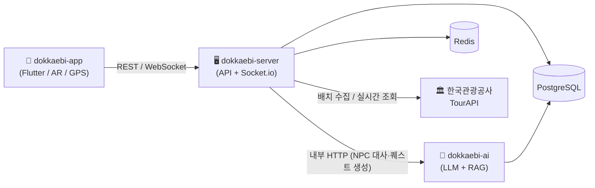

# 레포지토리 가이드 — 도깨비: 팔도의 비밀

> **도깨비: 팔도의 비밀** — AR 기반 생성형 멀티유저 관광 탐정 RPG 플랫폼
> 한국관광공사 TourAPI 데이터를 게임 콘텐츠의 구조 자체로 작동시켜, 관광 분산을 게임 메커니즘 안에서 자연스럽게 유도하는 서비스입니다.

GitHub 조직: [`2026-genai-ar-tourism-data-rpg`](https://github.com/2026-genai-ar-tourism-data-rpg)

---

## 레포 구성 원칙

**런타임·배포 주기·스케일링 단위가 다른 것은 레포를 쪼개고, 같은 것은 묶는다.**

| 레포 | 역할 | 스택 | 배포 단위 |
|------|------|------|-----------|
| [`dokkaebi-app`](./dokkaebi-app.md) | 모바일 앱 (핵심) | Flutter / Dart | 앱스토어·플레이스토어 |
| [`dokkaebi-server`](./dokkaebi-server.md) | 백엔드 API + 실시간 서버 | Node.js / NestJS / Socket.io | 컨테이너 1개 |
| [`dokkaebi-ai`](./dokkaebi-ai.md) | 생성형 AI / NPC 서비스 | Python / FastAPI / RAG | 독립 컨테이너 |
| [`dokkaebi-infra`](./dokkaebi-infra.md) | 인프라·배포 | Docker / Compose / GitHub Actions | 핫패스=컨테이너 / 배치=Lambda |
| [`.github`](./dokkaebi-github.md) | 조직 프로필·공통 문서 | Markdown | — |

> 데이터 수집 파이프라인은 별도 레포로 빼지 않고 `dokkaebi-server`의 워커로 둡니다. 분리할 만큼 무겁지 않고 같은 DB를 사용하기 때문입니다.

---

## 아키텍처 개요



---

## 전체 클론 (조직 레포 한 번에)

```bash
# 작업 폴더에서 5개 레포를 순서대로 클론
git clone https://github.com/2026-genai-ar-tourism-data-rpg/dokkaebi-app.git
git clone https://github.com/2026-genai-ar-tourism-data-rpg/dokkaebi-server.git
git clone https://github.com/2026-genai-ar-tourism-data-rpg/dokkaebi-ai.git
git clone https://github.com/2026-genai-ar-tourism-data-rpg/dokkaebi-infra.git
git clone https://github.com/2026-genai-ar-tourism-data-rpg/.github.git
```

### 한 줄로 모두 클론

```bash
for r in dokkaebi-app dokkaebi-server dokkaebi-ai dokkaebi-infra .github; do
  git clone https://github.com/2026-genai-ar-tourism-data-rpg/$r.git
done
```

### gh CLI 사용 시

```bash
# 조직의 모든 레포를 현재 폴더로 클론
gh repo list 2026-genai-ar-tourism-data-rpg --limit 100 \
  | awk '{print $1}' \
  | xargs -L1 gh repo clone
```

> 갓 만든 빈 레포라 클론 시 `warning: 빈 저장소를 복제한 것처럼 보입니다.` 경고가 뜨는 건 정상입니다. 첫 커밋·푸시 후 사라집니다.

---

## 권장 협업 규칙 (2~4인 소규모 팀)

- 레포마다 책임자 1명 지정 (`CODEOWNERS`)
- `main` 브랜치 보호 + 기능 브랜치(`feature/*`) + PR 리뷰 1인 승인
- 커밋 컨벤션: `feat:`, `fix:`, `docs:`, `chore:` 등 (Conventional Commits)
- 앱 ↔ 서버 ↔ AI는 **API 계약(REST/WebSocket 스펙)으로만 결합** — 인터페이스 변경 시 PR로 공유
